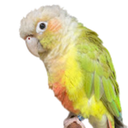

# KMIDS Veloz Future Engineer 2026

A robotics and engineering project focused on CAD design and system development.

Test Image

Other stuff are tests

## Project Components

| Component | Purpose |
|----------|--------|
| Chassis | Main structure of the robot |
| Steering system | Controls direction |
| Sensors | Detect obstacles |
| Controller | Runs the logic |

## Features

- Ackermann steering mechanism
- Modular chassis design
- Sensor mounting support
- Expandable component layout
- Designed for Future Engineer 2026