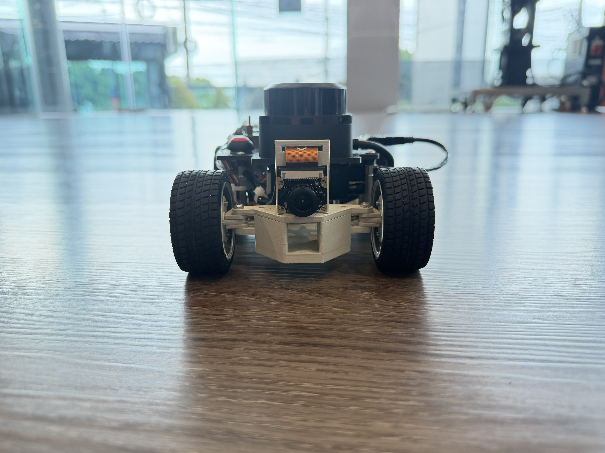
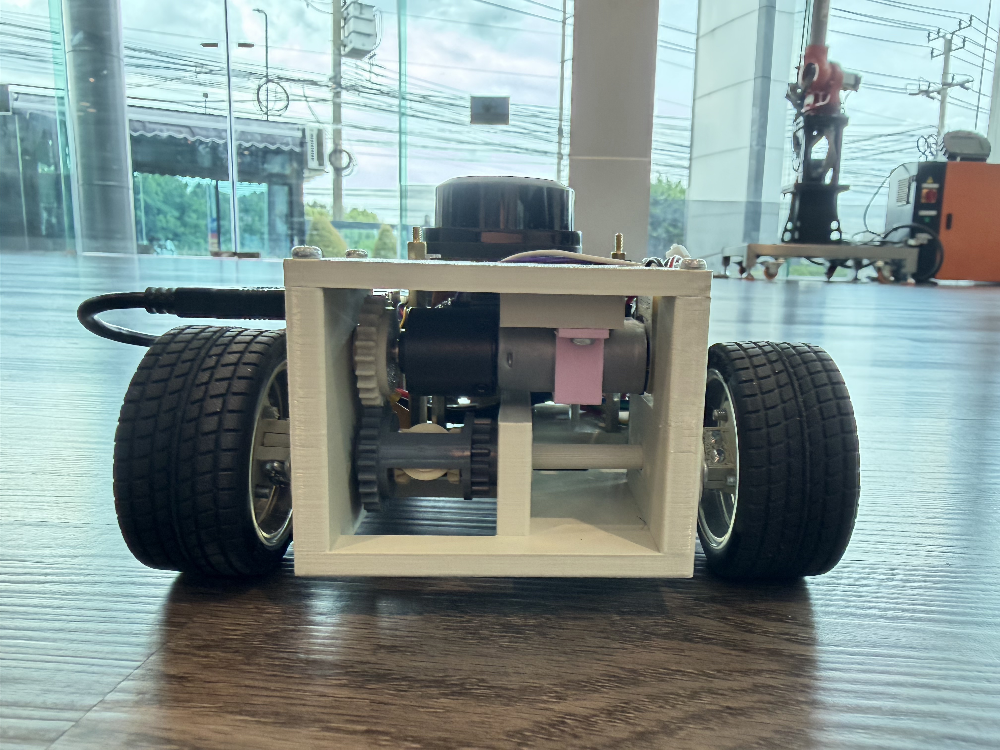
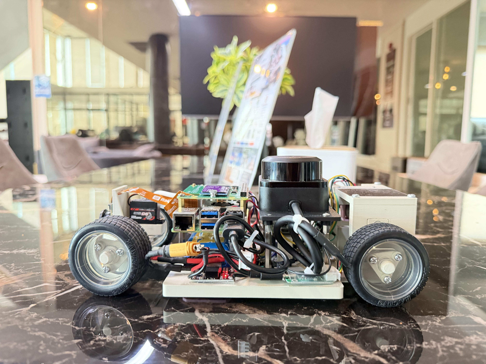
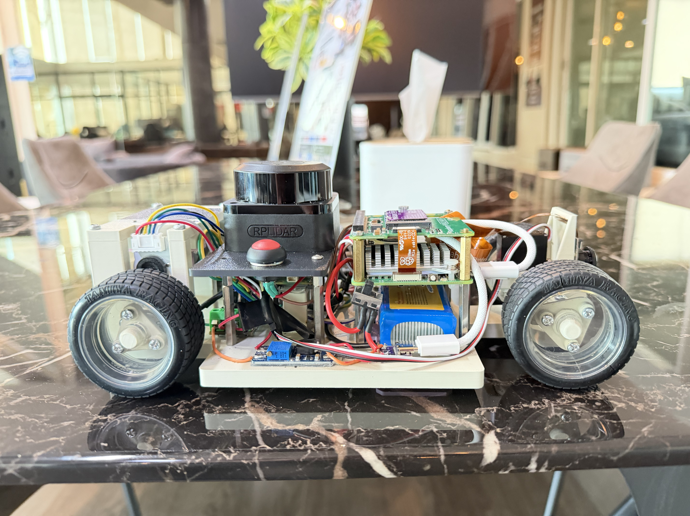
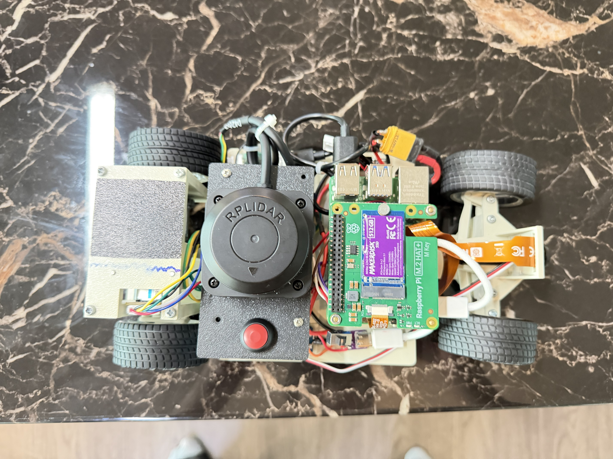
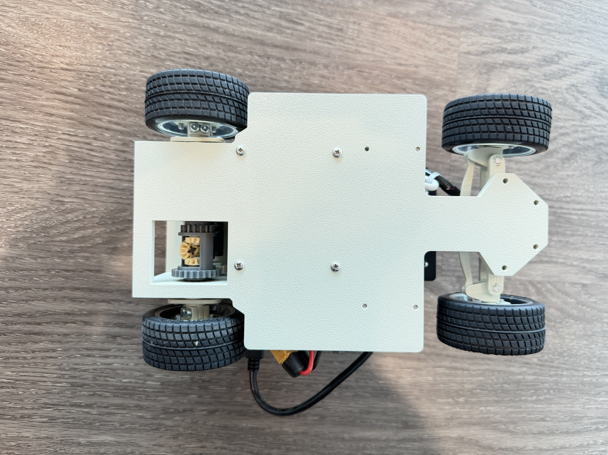
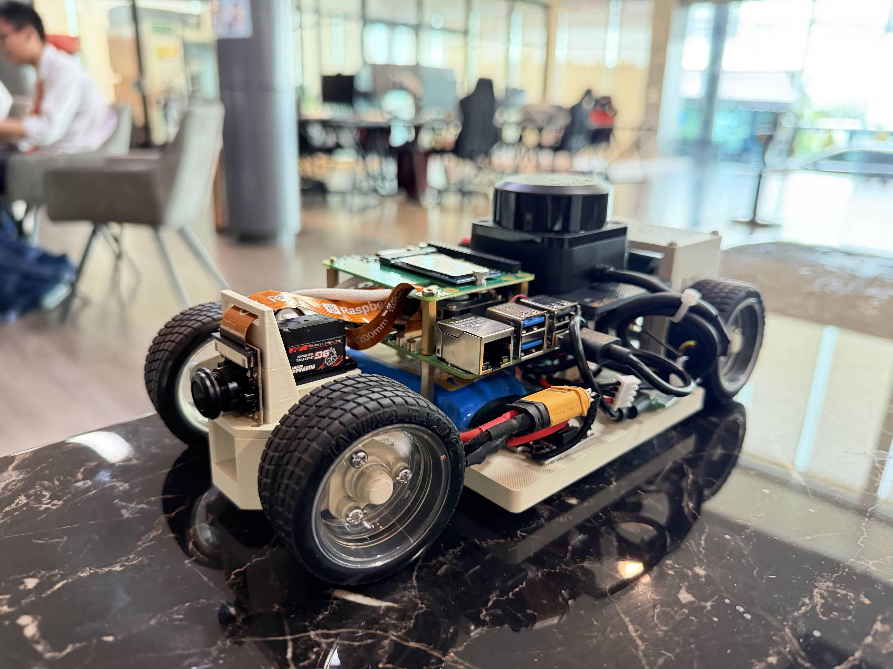
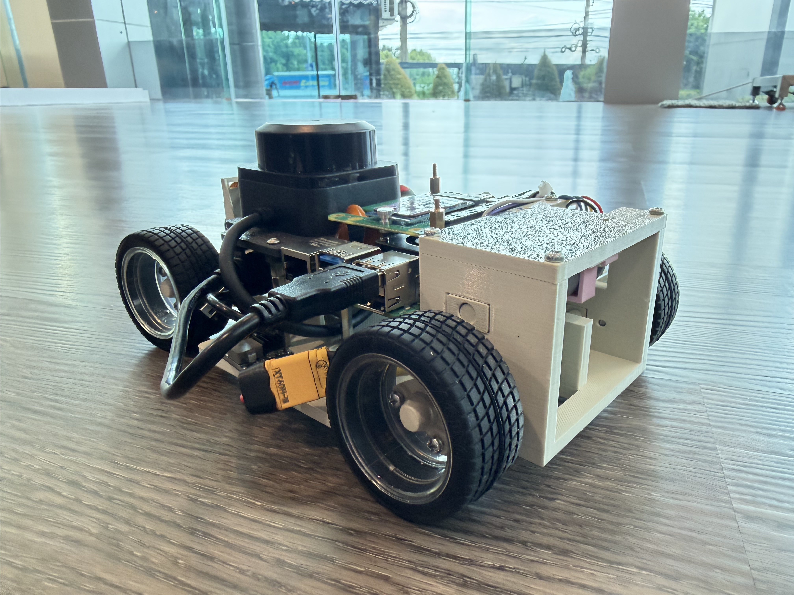
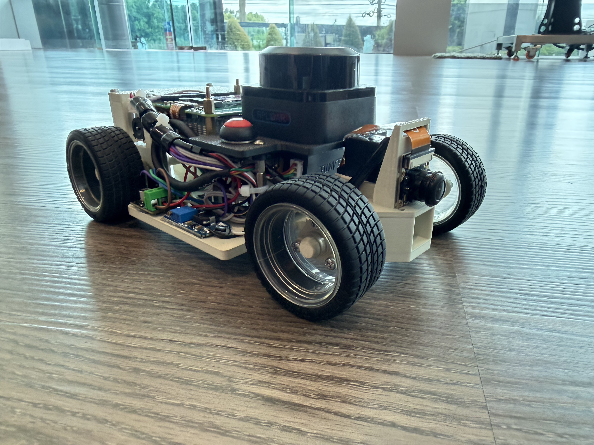
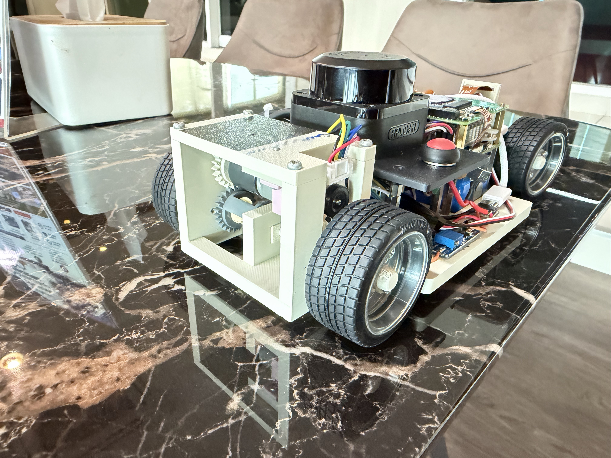

<div align="center">

# KMIDS Veloz
## 2026 WRO – Future Engineers
**Official Engineering Documentation**

> Designing, building, and continuously improving an autonomous vehicle for the World Robot Olympiad Future Engineers challenge.

<!-- IMAGE: Robot overview photo (final robot, 3/4 angle, clean background) -->


</div>

---

## Team Members

- **Sahas Ninvatchararang (Phonpa)**
- **Olan Sinsuriya (Olan)**
- **Phisit Chuthomsuwan (Champ)**

<!-- IMAGE: Team photo -->


KMIDS Veloz is a team of students exploring autonomous driving through mechanical design, embedded systems, computer vision, and control theory. Over the course of the WRO Future Engineers 2026 season, our work has covered hardware selection, CAD design, electronics integration, and the software architecture running on our two onboard boards, along with the testing and iteration that shaped each of those decisions. This document collects that process in one place: what we built, why we built it that way, and where a few pieces are still in progress.

---

## Table of Contents

1. [Overview](#1-overview)
   - [1.1 About the Project](#11-about-the-project)
   - [1.2 Robot Images](#12-robot-images)
   - [1.3 Performance Video](#13-performance-video)
2. [Mobility Management](#2-mobility-management)
   - [2.1 Drive System](#21-drive-system)
   - [2.2 Steering](#22-steering)
   - [2.3 Chassis Design](#23-chassis-design)
3. [Power and Sense Management](#3-power-and-sense-management)
   - [3.1 Power Source](#31-power-source)
   - [3.2 Sensor and Camera](#32-sensor-and-camera)
   - [3.3 Processing Units](#33-processing-units)
   - [3.4 Circuit Diagram](#34-circuit-diagram)
   - [3.5 Power Consumption](#35-power-consumption)
4. [Software Architecture](#4-software-architecture)
   - [4.1 Two-Board Split](#41-two-board-split)
   - [4.2 Perception Pipeline](#42-perception-pipeline)
   - [4.3 Control Loops](#43-control-loops)
5. [Obstacle Management](#5-obstacle-management)
   - [5.1 Open Challenge](#51-open-challenge)
   - [5.2 Obstacle Challenge](#52-obstacle-challenge)
   - [5.3 Parallel Parking](#53-parallel-parking)
6. [Systems Thinking and Engineering Decisions](#6-systems-thinking-and-engineering-decisions)
7. [Testing and Results](#7-testing-and-results)
8. [Source Code](#8-source-code)
   - [8.1 API Documentation](#81-api-documentation)
   - [8.2 Code Structure](#82-code-structure)
   - [8.3 Compilation / Upload Instructions](#83-compilation--upload-instructions)
9. [List of Components](#9-list-of-components)
10. [3D Model Files](#10-3d-model-files)
    - [10.1 FreeCAD Files](#101-freecad-files)
    - [10.2 STL Files](#102-stl-files)
    - [10.3 Slicer Files](#103-slicer-files)
11. [Building Instructions](#11-building-instructions)
12. [Development Process and Future Improvements](#12-development-process-and-future-improvements)
    - [12.1 Mechanical Iteration History](#121-mechanical-iteration-history)
    - [12.2 Planned Improvements](#122-planned-improvements)
13. [License](#13-license)

---

## 1. Overview

### 1.1 About the Project

The WRO Future Engineers category requires a vehicle to complete a driving course fully autonomously. The competition is split into two challenges. In the **Open Challenge**, the robot must complete three laps of an empty track without making contact with any wall. In the **Obstacle Challenge**, the track additionally contains randomly placed obstacle pillars that the robot must pass on the correct side, and the run finishes with a precision parallel-parking maneuver into a bay whose position is not known in advance. In both challenges the driving direction and the track layout are randomized before the run starts, and in the Obstacle Challenge the pillar placement is randomized as well, so the robot has to work out what it's facing from its own sensors rather than following a pre-programmed path.

Our robot splits its computing across two boards to meet these requirements. A **Raspberry Pi 5** handles perception, which covers LIDAR processing, camera-based traffic-light detection, and sensor fusion, along with the high-level decision making that determines what the robot should do next. A **Raspberry Pi Pico 2** runs the real-time control loop for the drive motor and steering servo, and communicates with the Pi 5 over I²C. This split exists because the two workloads have different timing requirements. Perception on the Pi 5 can tolerate an occasional slow frame without much consequence, but motor and servo control cannot. Keeping the hard real-time control loop on its own board, isolated from the heavier and less deterministic perception workload, means a slow camera or LIDAR frame on the Pi 5 never causes the robot to lose control of its speed or steering mid-maneuver.

### 1.2 Robot Images

The six required orientation views, four additional angled shots, and a photo of the internal electronics layout are collected below.

<!-- IMAGES: required six views, using our actual filenames -->
| Front | Rear | Left |
|---|---|---|
|  |  |  |

| Right | Top | Bottom |
|---|---|---|
|  |  |  |

**Additional angles:**

| Left side | Left-rear | Right side | Right-rear |
|---|---|---|---|
|  |  |  |  |

<!-- IMAGE: Internal electronics — open chassis or component stack, shows sensor/board placement -->


### 1.3 Performance Video

<!-- VIDEO: Open Challenge — YouTube link, ≥30s of visible autonomous driving -->
**Open Challenge:** `TODO — add YouTube link`

<!-- VIDEO: Obstacle Challenge — YouTube link, ≥30s of visible autonomous driving -->
**Obstacle Challenge:** `TODO — add YouTube link`

These two parts show both the Open and Obstacle Challenges respectively.

[Back to Top](#kmids-veloz)

---

## 2. Mobility Management

This section covers how the robot moves: what drives the rear wheels, how the front wheels are steered, and how the chassis is built to hold both systems together.

- **Drive system:** a single 20GP-180 DC gearmotor with an integrated encoder drives the rear wheels.
- **Steering:** the front wheels use Ackermann-geometry steering, actuated by a Surpass Hobby S0009M servo.

### 2.1 Drive System

Drive comes from a single **20GP-180** DC gearmotor fitted with a quadrature encoder. Power is transferred through a printed motor gear (`MotorGear.FCStd`), and the motor itself is mounted using a motor holder and a detachable motor plate (`MotorHolder.FCStd`, `MotorPlate.FCStd`). The motor plate is deliberately kept as a separate piece rather than being printed as part of the main chassis, so the motor can be swapped out, whether for maintenance or for a different motor entirely, without needing to reprint the chassis.

| Spec | Value | Source |
|---|---|---|
| Rated voltage | 6–12V (we run at 12V, stepped up from the 5V logic rail) | Datasheet |
| Weight | ~80g | Datasheet |
| Gearbox | All-metal planetary | Datasheet |
| Encoder | 28 pulses/rev × 100:1 gear ratio | Our firmware (`ENCODER_PULSE_PER_REV`, `ENCODER_GEAR_RATIO`) |
| No-load RPM / stall torque | `TODO — depends on the specific gear ratio variant; check the label on the gearbox or datasheet page for our exact ratio` | — |

**Reason for selection:** the encoder was the deciding factor in choosing this motor over an equivalent plain DC motor. With encoder feedback, the Pico's closed-loop speed controller can hold a target wheel speed in rotations per second, rather than driving the motor at a fixed PWM duty cycle and hoping the resulting speed stays consistent. This matters for lap-time repeatability specifically because a duty-cycle-only approach drifts as the battery voltage sags over the course of a run. The same PWM signal produces less actual speed late in a run than it does at the start, whereas closed-loop RPS control compensates for that automatically by increasing duty cycle as needed to hold the target speed.

<!-- TODO: describe any gear ratio or motor swap you actually tested, with a before/after result (e.g. lap consistency, stall issues on carpet vs the WRO mat, etc.) — the single highest-value addition left for this section, since it's the one thing a datasheet can't provide. -->

### 2.2 Steering

<!-- IMAGE: Ackermann steering geometry reference diagram -->


Our steering geometry (`FreeCAD-Files/Models/SteeringAckermannModel.FCStd`) follows an Ackermann-style linkage, built from printed T-bone and transfer linkage parts (`TBoneLinkageTop/Bottom`, `TransferLinkageLeft/Right`, `WheelLinkageTopLeft/Right`, `WheelLinkageBottomLeft/Right`). Ackermann geometry angles the inner and outer front wheels differently during a turn so that both wheels roll instead of scrubbing sideways against the mat. This matters most in the Obstacle Challenge, where the robot needs a tight and repeatable turning radius to get around pillars and into the parking bay without excess slip changing its actual path from run to run.

The diagram above is a general technical reference for the Ackermann geometry principle, not a rendering of our specific linkage. See the FreeCAD file and the CAD assembly image in Section 2.3 for our actual implementation. <!-- TODO: if you remember the source of this diagram, add a one-line credit here for good practice. -->

**Servo: Surpass Hobby S0009M (9g digital)**

| Spec | Value |
|---|---|
| Rated torque | 1.1 kgf·cm |
| Speed | 0.15 sec/60° |
| Voltage | 5V |
| Gearing | Metal |
| Type | Digital |

**Reason for selection:** the servo's small size and standard PWM interface make it easy to drive directly from the Pico 2, without needing a separate driver board. It also provides enough torque to steer the front wheels responsively at this vehicle's weight, while being small and light enough to mount directly to the front plate without any extra bracketry.

The physical steering range is also constrained in firmware, not just by the linkage geometry. The Pico 2 maps a `-100%`–`+100%` steering command to a servo pulse between **44° and 136°** (`STEERING_MIN_ANGLE` / `STEERING_MAX_ANGLE` in `main.cpp`), rather than using the servo's full mechanical sweep. Clamping the usable range in software, once the linkage's real mechanical limits are known from testing, means we can adjust that range at any time without having to reprint anything or re-adjust the servo horn by hand.

### 2.3 Chassis Design

The finished chassis body measures **244mm (long axis) × 135mm (short axis) × 59mm (height)**, confirmed directly from the FreeCAD model's bounding-box geometry.

| Dimension | Value |
|---|---|
| Chassis (L × W × H) | 244 × 135 × 59 mm |
| Wheelbase (front-to-rear axle) | 185 mm |
| Track width (left-to-right wheel) | 85 mm |
| Wheel diameter | 54.7 mm |

<!-- IMAGE: Annotated CAD assembly (full robot, labeled: chassis, steering, motor, electronics stack) -->


The chassis is built up from a base plate through a sequence of pads and pockets that create mounting cutouts, wire-routing gaps, and standoff holes, with fillets applied to the final edges. This approach does two things at once: it keeps the whole robot well within the WRO 300×200×300mm size limit with margin to spare, and it leaves room to reposition the electronics stack later without having to redesign the body from scratch.

[Back to Top](#kmids-veloz)

---

## 3. Power and Sense Management

### 3.1 Power Source

The system's primary logic rail, which supplies the Raspberry Pi 5, Pico 2, camera, IMU, and LIDAR, runs at **5V**. This rail is fed through a UPS module that reports its state of charge over I²C, using register `0x17`, matching the EP-0136 protocol read by our `check_battery_status.py` script. Motor power is handled separately: it is stepped up to 12V, since the 20GP-180 gearmotor is rated above what the 5V logic rail can supply on its own.

To protect the battery from being damaged by over-discharge, a `set_battery_min.py` / `ups_shutdown.py` script pair lets the robot shut down gracefully once the battery reaches a defined minimum, rather than simply cutting out mid-run. This is our answer to the question of what happens on power failure: instead of browning out unpredictably in the middle of a maneuver, the robot shuts down in a controlled and predictable way.

Motor power and logic power are switched together through a single **N-channel MOSFET on GPIO 19** of the Pico (`MOSFET_PIN`), which the firmware drives high at boot. This means a single physical switch controls power delivery to all of the drive electronics, independently of the Raspberry Pi 5's own power state.

### 3.2 Sensor and Camera

<!-- IMAGE: Sensor placement photo/diagram — top-down or side view showing lidar/camera/IMU mounting points -->


Each sensor's mounting position was chosen for a specific reason tied to what it needs to see or measure, rather than wherever happened to have free space on the chassis.

| Sensor | Placement | Why there |
|---|---|---|
| Slamtec RPLidar S2 | Rear-elevated, above the motor plate, on a standoff-mounted plate | 360° unobstructed view needs it clear of the chassis body and drivetrain height — mounting behind and above the motor plate was the only position with a full clear sweep |
| Fish-eye camera | Front plate, forward-facing | Needs a forward view of pillars and lane lines ahead of the robot; front-mounting keeps its field of view unobstructed by the chassis |
| BNO085 IMU | Center of chassis, near the Pico 2 | Mounting near the physical center of rotation reduces the lever-arm effect of vibration and centripetal acceleration during turns, which otherwise pollutes the accelerometer/gyro reading |

**Calibration:** camera exposure, gain, and white balance are locked in firmware at startup (`cameraOptionCallback` in `obstacle_challenge/main.cpp`) rather than left on auto. Locking these values means color thresholding for red and green pillars stays consistent for the whole run instead of drifting frame-to-frame as the camera's auto-exposure reacts to the competition's fixed lighting. <!-- TODO: describe the IMU calibration step/routine if you have one — the I2C command map already includes an IMU-calibration trigger (see 3.4), worth a sentence on when/how you run it. -->

**Failure handling:** <!-- TODO: describe what actually happens today if the LIDAR, camera, or I2C link drops mid-run — does the robot stop, fall back to dead-reckoning, or is this not yet handled? Even "not yet handled, planned for X" is honest, scoreable content. -->

### 3.3 Processing Units

| Board | Responsibility | Update rate |
|---|---|---|
| Raspberry Pi 5 | LIDAR processing, camera processing, sensor fusion, high-level state machine | ~60 Hz main loop |
| Raspberry Pi Pico 2 | IMU polling, closed-loop motor speed PID, servo positioning, I²C slave | IMU: 4 ms / Motor PID: 8 ms |

The Pi 5 handles perception because that workload isn't hard-real-time; it can tolerate an occasional slow frame without breaking anything downstream. Motor and servo control need to be deterministic, so that work lives entirely on the Pico 2, with the Pi 5 only ever sending it target setpoints rather than managing the control loop itself. Section 4 covers this software split in more detail.

### 3.4 Circuit Diagram

<!-- IMAGE: Wiring/power block diagram -->


The diagram above is a full circuit-level schematic showing power distribution, from battery to UPS to the 5V logic rail, and separately from battery to step-up converter to the 12V motor rail, alongside all sensor and controller wiring.

The Pi 5 and Pico 2 communicate over a **256-byte I²C shared-memory protocol** (`shared/i2c/pico_i2c_mem_addr.h`), with the Pico acting as I²C slave at address `0x39` on a 400 kHz bus. Rather than a simple one-way sensor stream, the memory map is split into fixed regions, each with its own direction and purpose:

| Region | Direction | Contents |
|---|---|---|
| `COMMAND_ADDR` | Pi 5 → Pico | Restart, IMU calibration mode, skip-calibration |
| `STATUS_ADDR` | Pico → Pi 5 | Bit-packed running/IMU-ready flags |
| `IMU_DATA_ADDR` | Pico → Pi 5 | Fused accelerometer + Euler angles |
| `ENCODER_ANGLE_ADDR` | Pico → Pi 5 | Current wheel encoder angle |
| `MOVEMENT_INFO_ADDR` | Pi 5 → Pico | Target motor speed (RPS) + steering percent |

Because the map runs in both directions, the Pi 5 can issue high-level commands, such as target speed, target steering, or a calibration trigger, while the Pico independently closes the low-level control loop and reports sensor state back on its own schedule. The Pi 5 never has to wait on a round-trip request just to find out the robot's current heading or encoder position; that data is always sitting ready in the shared memory the next time the Pi 5 checks.

### 3.5 Power Consumption

The system utilizes a dual-voltage topology: a main 5V logic rail supplied via the I²C-monitored UPS module, and a stepped-up 12V rail dedicated to the drive motor driver to isolate high-current inductive spikes from logic electronics.

| Component | Rail Voltage | Nominal Current (Idle) | Peak Current (Full Load) | Notes / Source |
|---|---|---|---|---|
| **Raspberry Pi 5 (8 GB) + M.2 HAT** | 5V | ~800 mA | ~2,500 mA | Heavy load during CV + LIDAR processing |
| **Raspberry Pi Pico 2 + IMU (BNO085)** | 5V | ~30 mA | ~50 mA | Deterministic control loop & sensor polling |
| **Slamtec RPLidar S2** | 5V | ~40 mA | ~400 mA | Active 360° laser scanning |
| **Fish-eye Camera (5MP)** | 5V | ~150 mA | ~250 mA | Locked exposure pipeline |
| **Surpass Hobby S0009M Servo** | 5V | ~10 mA | ~400 mA | Steering under max cornering torque |
| **20GP-180 DC Gearmotor** | 12V (boosted) | ~280 mA | ~2,700 mA | Stall / hard acceleration peak |

**Power Budget Summary:**
- **5V Logic Rail Total:** ~1.03 A (Nominal) / **~3.60 A (Peak)**
- **12V Motor Rail Total:** ~0.28 A (Nominal) / **~2.70 A (Peak)**
- **System Safety Margin:** Power management incorporates battery monitoring over I²C (`check_battery_status.py`) with software-enforced low-voltage thresholds (`set_battery_min.py` / `ups_shutdown.py`) to prevent brownouts under peak motor load and protect Li-ion cells from over-discharge.

[Back to Top](#kmids-veloz)

---

## 4. Software Architecture

### 4.1 Two-Board Split

Code is organized into `modules` (hardware interfaces such as the camera, lidar, pico2 link, and i2c), `processors` (pure data-processing logic for lidar, camera, and combined sensor fusion), `utils` (the PID controller, logger, and ring buffer), and `types` (shared data structures), with a `shared/` directory holding the I²C protocol and structs used by both boards. Every module and processor directory has its own `README.md` documenting its public API, so the interface for any given piece can be checked without reading through its implementation.

### 4.2 Perception Pipeline

**LIDAR processing** (`lidar_processor`) converts raw polar scan points into Cartesian coordinates, filters out points that are too close (under 0.005 m) or too far (over 3.2 m) to be useful, and then clusters the remaining nearby points into `LineSegment`s that represent candidate walls. These candidates are bucketed by their position relative to the robot (front, back, left, or right) and resolved into a single wall per side using the robot's current heading estimate.

**Camera processing** (`camera_processor`) converts each frame to HSV and thresholds it against tuned red, green, and pink ranges to find traffic-pillar candidates. Before thresholding, the top half of the frame is blacked out to suppress noise from ceiling lights, and contour centroids above a minimum area are then extracted from what remains.

<!-- IMAGE: LIDAR/camera sensor-fusion diagram — how a camera color blob + a LIDAR point become one TrafficLightInfo -->


**Sensor fusion** (`combined_processor`) does two things. First, it synchronizes camera frames with LIDAR scans by timestamp, accounting for a configurable camera-to-LIDAR delay offset, since the two sensors don't sample at the same instant or at the same rate. Second, it matches each camera-detected color blob to the nearest LIDAR point along the same angular ray. The result is that every detected pillar ends up with both a color and type from the camera and a precise distance and position from the LIDAR, combined into a single `TrafficLightInfo`.

### 4.3 Control Loops

Two independent PID controllers run in the main loop. A **heading PID** steers the robot to hold a target compass heading, and a **wall-following PID** produces an output that is added as an offset to that heading target, pulling the robot toward a target distance from the outer wall. The wall PID is explicitly toggled off during turns (`wallPid_.setActive(false)`), so that wall-following doesn't fight the turn that's already in progress, and it's re-enabled only once the turn completes. It's a small detail, but a deliberate one: without it, the two control loops would be actively working against each other for the duration of every turn.

On the Pico 2, a third PID closes the loop on wheel speed, using encoder feedback against a target RPS. Because that loop runs entirely on the Pico, the Pi 5 only ever needs to say "go at this speed" rather than managing PWM duty cycle directly.

[Back to Top](#kmids-veloz)

---

## 5. Obstacle Management

### 5.1 Open Challenge

<!-- IMAGE: Open Challenge state-machine diagram -->


The open-challenge robot (`apps/challenges/open_challenge/main.cpp`) runs a five-state machine. It starts in `NORMAL`, driving straight with wall-following active, and moves to `PRE_TURN` once a front wall is detected within 1.2 m. `PRE_TURN` is cooldown-gated so it can't re-trigger mid-turn. From there it enters `TURNING`, where the wall PID is disabled and the heading target is snapped 90° in the detected turn direction. Once heading settles within a 20° tolerance, the state machine returns to `NORMAL`. This cycle repeats for 12 turns, corresponding to three laps of four corners each, before the robot enters `PRE_STOP` and finally `STOP`.

### 5.2 Obstacle Challenge

<!-- IMAGE: Obstacle Challenge decision-flow diagram -->


**Pillar pass-left / pass-right logic:**

<!-- TODO: this is the most important remaining content gap in the whole document. Currently our documented pipeline only covers detecting a pillar's color and position (Section 4.2) — the decision logic that turns that detection into an actual pass-left/pass-right maneuver is being rewritten and will be documented once the new code is in. Write 2-4 sentences in your own words once ready: does the robot set a target lateral offset, switch which wall it's following, insert a temporary waypoint? -->

**Direction-dependent tuning:** the obstacle-challenge state machine is significantly larger than the open-challenge one, because the correct behavior branches on two things the robot only learns at runtime: which direction it's driving, clockwise or counter-clockwise, and where the parking bay ends up relative to its approach. Distinct constants exist for each combination. For example, `TARGET_OUTER_WALL_DISTANCE_PARKING_CCW` is 0.29 m while `TARGET_OUTER_WALL_DISTANCE_PARKING_CW` is 0.31 m, and there are separate turning-radius thresholds for a normal turn versus a "push" turn (`TURNING_FRONT_WALL_DISTANCE` versus `..._PUSH`). Having distinct constants for each case, rather than one shared value, reflects that these were tuned independently through testing rather than assumed to generalize.

**Edge cases:** <!-- TODO: list 2-3 specific edge cases the state machine actually handles or has been tested against — e.g. what happens if two pillars are close together, if a pillar is only partially visible to the camera but fully visible to LIDAR, or if the robot approaches the parking bay at the very edge of its turning radius. -->

### 5.3 Parallel Parking

<!-- IMAGE: Parking sequence diagram -->


Parking uses direction-specific approach states, `CCW_UNPARK_1..4` and `CW_UNPARK_1..2`, along with dedicated pre-parking and U-turn states. These states differ because a counter-clockwise approach and a clockwise approach reach the parking bay from geometrically different angles, and each needs its own sequence of forward and reverse moves to align correctly. Parking-bay detection itself relies on the same LIDAR wall-resolution pipeline described in Section 4.2, rather than a separate detection method. <!-- TODO: confirm and describe exactly how the bay boundary is recognized (e.g. a gap of a known width between two wall segments) — the second most valuable missing paragraph after the pillar-pass logic above. -->

[Back to Top](#kmids-veloz)

---

## 6. Systems Thinking and Engineering Decisions

- **Splitting perception and control across two boards** was a direct response to a timing constraint: the Pi 5's LIDAR and camera processing pipeline is not hard-real-time, but motor and servo control need to be. Rather than trying to keep the whole loop deterministic on a single board, we moved the time-critical motor PID and servo output onto the Pico 2 and let the Pi 5 issue target setpoints over I²C instead. The practical effect is that the Pi 5 can hiccup on a slow perception frame without a wheel ever losing speed control.

- **Bidirectional shared-memory I²C instead of a simple sensor stream.** The same 256-byte map carries commands, calibration triggers, and status flags in both directions, so the Pi 5 can trigger IMU calibration or a Pico restart without needing a second communication channel dedicated to control messages.

- **Decoupling the wall-following and heading PIDs, with an explicit toggle during turns.** An earlier, combined approach let the two loops fight each other mid-turn. Disabling the wall PID during `TURNING`, and re-enabling it only once heading has settled, removed that interaction entirely.

- **Separate tuning constants per direction (CW/CCW) and per maneuver type (normal turn vs. "push" turn)** in the obstacle challenge, rather than one shared threshold for each. This reflects that the two driving directions approach walls and the parking bay from different geometry, and each needed its own independently tuned targets rather than a compromise value that would underperform in both directions.

- **Locking camera exposure, gain, and white balance in firmware** rather than relying on auto-exposure, so that color thresholding for red and green pillars stays consistent across different competition lighting instead of drifting frame-to-frame as the camera's own auto-exposure logic reacts to what it sees.

- **Choosing an encoder-equipped gearmotor over a plain DC motor**, specifically to enable closed-loop speed control on the Pico. This trades a slightly more complex wiring and firmware setup for speed that stays repeatable as battery voltage sags over a run, rather than accepting an open-loop PWM approach that would drift along with the battery's charge state.

<!-- TODO: add 1-2 more decisions with a concrete "we chose X over Y because..." — ideally something with a before/after number once Section 7 (Testing) has real data. -->

[Back to Top](#kmids-veloz)

---

## 7. Testing and Results

<!-- IMAGE: Testing-results graph/table — e.g. lap consistency over N runs, or tuning before/after -->


Every run through `open_challenge` and `obstacle_challenge` logs LIDAR, IMU, and encoder data with nanosecond timestamps to disk, through the `Logger` in `src/utils/logger`. Both `log_viewer` and `log_to_video` can replay these logs afterward, which lets us debug a failed run after the fact instead of relying only on what we could observe live on the field.

| Metric | Result |
|---|---|
| Open Challenge — laps attempted / completed | `TODO` |
| Obstacle Challenge — pillar-pass success rate | `TODO` |
| Parking — success rate over N attempts | `TODO` |
| Before/after result from a specific tuning change | `TODO` |

<!-- TODO: this whole section is the single biggest lever left for testing-metrics and tradeoff-evidence scoring — even a rough "12/15 successful parks over our last test session" beats no number at all. -->

[Back to Top](#kmids-veloz)

---

## 8. Source Code

### 8.1 API Documentation

<!-- TODO: point to or summarize the per-module README.md files (every modules/, processors/, and utils/ subdirectory already has one) — a short index here saves a judge from hunting through folders. -->

### 8.2 Code Structure

The codebase is split by hardware target, with a shared directory for the protocol and structs both boards need, so that platform-specific code never has to guess at the other board's internals.

```text
code/
├─ raspberry-pi-5/
│  ├─ apps/
│  │  ├─ challenges/
│  │  │  ├─ open_challenge/       # Open Challenge executable
│  │  │  └─ obstacle_challenge/   # Obstacle Challenge + parking executable
│  │  ├─ log_viewer/              # Visualize recorded run logs
│  │  ├─ log_to_video/            # Render logs to video
│  │  ├─ scan_map_inner/          # Inner-track mapping tool
│  │  ├─ scan_map_outer/          # Outer-track mapping tool
│  │  ├─ test_camera/             # Camera-only test app
│  │  ├─ test_i2c/                # I2C link test app
│  │  ├─ test_lidar/              # LIDAR-only test app
│  │  └─ test_lidar_cam/          # Combined LIDAR + camera test app
│  ├─ external/                   # lccv, RPLIDAR SDK
│  ├─ scripts/                    # Battery monitoring, shutdown, deploy
│  └─ src/
│     ├─ modules/                 # camera, lidar, i2c_master, pico2
│     ├─ processors/              # camera, lidar, combined (fusion)
│     ├─ types/                   # Shared data structures
│     └─ utils/                   # PID controller, logger, ring buffer
├─ raspberry-pi-pico-2/
│  └─ src/
│     ├─ modules/
│     │  ├─ controllers/          # bno085, motor, encoder, servo
│     │  └─ i2c_slave/            # I2C slave + shared memory protocol
│     └─ utils/pid_controller/
└─ shared/                        # i2c memory map, IMU struct — used by both boards
```

Every `modules/`, `processors/`, and `utils/` subdirectory has its own `README.md` documenting the classes and functions it exposes. Start there for API-level detail beyond what's summarized above.

### 8.3 Compilation / Upload Instructions

**Dependencies**
- **Raspberry Pi 5:** OpenCV, libcamera, the bundled `lccv` library, and the RPLIDAR SDK (in `code/raspberry-pi-5/external/`)
- **Raspberry Pi Pico 2:** the Pico SDK

**Raspberry Pi 5**
```bash
cd code/raspberry-pi-5
chmod +x build-arm64.sh
./build-arm64.sh
```
Binaries are output to `build/bin/`. We cross-compile using the provided `Dockerfile.cross` / `Dockerfile.compile` rather than building natively on the Pi, which keeps build times short and avoids having to install the full OpenCV/libcamera toolchain on the robot itself. `upload.sh` then `scp`s the built binaries and scripts to the robot.

**Raspberry Pi Pico 2**
```bash
cd code/raspberry-pi-pico-2
chmod +x build.sh
./build.sh
```
Flash the resulting `.uf2` file to the Pico in bootloader mode (hold BOOTSEL while connecting via USB, then copy the file to the mounted drive), or with `picotool`:
```bash
sudo picotool load build/<output_name>.uf2 -f
```
<!-- TODO: confirm the exact .uf2 output filename from your Pico CMakeLists.txt (check the `pico_add_extra_outputs` target name) and replace <output_name> above. -->

[Back to Top](#kmids-veloz)

---

## 9. List of Components

| Component | Model | Quantity |
|---|---|---:|
| Single-board computer | Raspberry Pi 5 (8 GB) | 1 |
| Microcontroller | Raspberry Pi Pico 2 | 1 |
| PCIe adapter | Raspberry Pi M.2 HAT+ | 1 |
| LIDAR | Slamtec RPLidar S2 | 1 |
| Camera | Fish-eye Raspberry Pi 5MP IR Camera | 1 |
| IMU | BNO085 9-axis IMU | 1 |
| Drive motor | 20GP-180 DC gearmotor with quadrature encoder | 1 |
| Steering servo | Surpass Hobby S0009M (9g digital servo) | 1 |
| Power/UPS module | I²C battery-monitoring UPS (EP-0136-compatible protocol) | 1 |
| Motor driver | DRV8871 | 1 |
| Power switch | N-Channel MOSFET | 1 |
| Camera wire | — | 3 |

> Our CAD part files are still internally named `S0004m.FCStd` and `RPLidarC1.FCStd` from an earlier design pass. The table above reflects the actual parts installed on the robot: the S0009M servo and the RPLidar S2. <!-- TODO: rename the CAD files to match before final submission, for reproducibility clarity. -->

Each component was selected with reliability, I²C/PWM compatibility with our Pi 5 + Pico 2 split architecture, availability, and ease of replacement mid-season all weighed together, rather than optimizing for any single one of those criteria alone.

<!-- TODO: fill in exact source/supplier links per component, and exact part-number variants where relevant. -->

[Back to Top](#kmids-veloz)

---

## 10. 3D Model Files

All mechanical parts are modeled in FreeCAD before printing.

### 10.1 FreeCAD Files

- [`FreeCAD-Files/Models/SteeringAckermannModel.FCStd`](FreeCAD-Files/Models/SteeringAckermannModel.FCStd) — steering geometry development model
- [`FreeCAD-Files/Parts/`](FreeCAD-Files/Parts/) — individual reusable parts (chassis, linkages, axles, mounts, gears)

### 10.2 STL Files

<!-- TODO: list exported STL files per part, once finalized — same structure as the Parts/ folder above. -->

### 10.3 Slicer Files

- [`Slicer-Files/`](Slicer-Files/) — `.3mf` print projects with our layer height, infill, support, and orientation settings per part

<!-- TODO: break out per-part slicer settings into a short table (layer height / infill / support type) once finalized — helps reproducibility scoring directly. -->

[Back to Top](#kmids-veloz)

---

## 11. Building Instructions

<!-- TODO: this section doesn't exist yet. Once the current build is stable, write the physical assembly sequence step by step — steering assembly, drivetrain assembly, electronics mounting, final wiring — the way a judge could follow along and reproduce the robot. This is explicitly one of the things "reproducibility" scoring checks for. -->

[Back to Top](#kmids-veloz)

---

## 12. Development Process and Future Improvements

### 12.1 Mechanical Iteration History

<!-- TODO: describe any version history you have — e.g. "steering v1 used X linkage, we found Y problem, v2 changed Z." Even one iteration with a before/after result is worth more than a paragraph of description with no history. -->

### 12.2 Planned Improvements

- Add remaining photos (robot overview, internals) and Open/Obstacle Challenge demonstration videos
- Fill in wheel diameter, current-draw power budget, and remaining diagram placeholders
- Write up the pillar pass-left/pass-right decision logic once the new obstacle-challenge code is finalized, and the parking-bay detection method
- Record lap-consistency and parking-success metrics from testing (Section 7)
- Rename CAD files to match final part numbers (S0004m → S0009M, RPLidarC1 → RPLidar S2)
- Write the physical Building Instructions (Section 11)
- Fill in exact git commit/version information and confirm the Pico `.uf2` output filename

[Back to Top](#kmids-veloz)

---

## 13. License

This repository is distributed under the MIT License.

---

**KMIDS Veloz • WRO Future Engineers 2026**