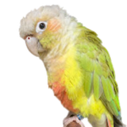

<div align="center">

# KMIDS Veloz
## 2026 WRO – Future Engineers
**Official Engineering Documentation**

> Designing, building, and continuously improving an autonomous vehicle for the World Robot Olympiad Future Engineers challenge.

<!-- TODO: replace with a real front-view photo of the robot -->


</div>

---

## Team Members

- **Sahas Ninvatchararang (Phonpa)**
- **Olan Sinsuriya (Olan)**
- **Phisit Chuthomsuwan (Champ)**

KMIDS Veloz is a team of students exploring autonomous driving through mechanical design, embedded systems, computer vision, and control theory. This repository documents our full engineering process for the WRO Future Engineers 2026 season: hardware selection, CAD, electronics, software architecture, and the testing/iteration behind our design decisions.

---

## Table of Contents

1. [Overview](#1-overview)
2. [List of Components](#2-list-of-components)
3. [Mechanical Design](#3-mechanical-design)
4. [Power and Sensor Architecture](#4-power-and-sensor-architecture)
5. [Software Architecture](#5-software-architecture)
6. [Obstacle and Parking Strategy](#6-obstacle-and-parking-strategy)
7. [Systems Thinking and Engineering Decisions](#7-systems-thinking-and-engineering-decisions)
8. [Repository Structure](#8-repository-structure)
9. [Build and Upload Instructions](#9-build-and-upload-instructions)
10. [Development Process and Future Improvements](#10-development-process-and-future-improvements)
11. [License](#11-license)

---

## 1. Overview

### 1.1 About the Project

The WRO Future Engineers category requires a vehicle to complete a driving course fully autonomously, first on an open track (three laps, no wall contact) and then on a track with randomly placed obstacle pillars that must be passed on the correct side, ending in a precision parallel-parking maneuver.

Our robot splits its computing across two boards: a **Raspberry Pi 5** handles perception (LIDAR processing, camera-based traffic-light detection, sensor fusion) and high-level decision making, while a **Raspberry Pi Pico 2** runs the real-time control loop for the drive motor and steering servo, communicating with the Pi 5 over I²C. This split keeps hard real-time motor control isolated from the heavier, less deterministic perception workload.

### 1.2 Robot Images

<!-- TODO: add photos — front, rear, left, right, top, bottom, internal electronics, and a team photo. Required by the WRO rules. -->

### 1.3 Performance Video

<!-- TODO: add YouTube links — one video for the Open Challenge, one for the Obstacle Challenge, each showing at least 30 seconds of autonomous driving. -->

---

## 2. List of Components

| Component | Quantity |
|---|---:|
| Raspberry Pi 5 (8 GB) | 1 |
| Raspberry Pi Pico 2 | 1 |
| Raspberry Pi M.2 HAT+ | 1 |
| Slamtec RPLidar (C1) | 1 |
| Fish-eye Raspberry Pi 5MP IR Camera | 1 |
| BNO085 9-axis IMU | 1 |
| 20GP-180 DC motor with quadrature encoder | 1 |
| Steering servo | 1 |
| UPS power module (I²C battery monitoring, EP-0136-compatible) | 1 |
| DRV8871 motor driver | 1 |
| N-Channel MOSFET (power switching) | 1 |
| Camera wire | 3 |

> **Note:** Our earlier drafts of this table listed a Surpass Hobby S0009M servo and a generic "Slamtec RPLidar." Our current CAD models and part files reference an **S0004m servo** and an **RPLidar C1** specifically — <!-- TODO: confirm final part numbers here and update both this table and Section 4 with the correct torque/range specs once confirmed. -->

Each component was selected considering reliability, I²C/PWM compatibility with our Pi 5 + Pico 2 split architecture, availability, and ease of replacement mid-season.

---

## 3. Mechanical Design

All mechanical parts are modeled in FreeCAD before printing. The CAD source is organized as full assemblies (`FreeCAD-Files/Models/`) and individual reusable parts (`FreeCAD-Files/Parts/`), with matching slicer projects (`Slicer-Files/*.3mf`) for printed components.

### 3.1 Chassis

The chassis (`Chassis.FCStd`) is the structural base for the drivetrain, steering assembly, electronics stack, and LIDAR mount. The finished chassis body measures **244mm (width) × 135mm (length) × 59mm (height)**, built up from a base plate through a series of pads and pockets in FreeCAD for mounting cutouts, wire routing gaps, and standoff holes, with fillets applied on the final edges. <!-- TODO: add wheelbase (front-to-rear axle distance) and track width (left-to-right wheel distance) — these aren't part of the chassis body bounding box, so they need either a physical measurement or the assembly file with axle holder positions. -->

### 3.2 Steering

Our steering geometry (`FreeCAD-Files/Models/SteeringAckermannModel.FCStd`) follows an Ackermann-style linkage, built from printed T-bone and transfer linkage parts (`TBoneLinkageTop/Bottom`, `TransferLinkageLeft/Right`, `WheelLinkageTopLeft/Right`, `WheelLinkageBottomLeft/Right`). Ackermann geometry angles the inner and outer front wheels differently during a turn so both roll rather than scrub, which matters most in the Obstacle Challenge where the robot needs a tight, repeatable turning radius around pillars and into the parking bay.

The physical steering range is constrained in firmware, not just geometry: the Pico 2 maps a `-100%`–`+100%` steering command to a servo pulse between **44° and 136°** (`STEERING_MIN_ANGLE` / `STEERING_MAX_ANGLE` in `main.cpp`), rather than the servo's full mechanical sweep. This lets us clamp the usable range in software once we know the linkage's real mechanical limits, without having to reprint or re-adjust the horn.

### 3.3 Drivetrain

Drive comes from a single DC gearmotor with a quadrature encoder, geared through a printed motor gear (`MotorGear.FCStd`) mounted via a motor holder and detachable motor plate (`MotorHolder.FCStd`, `MotorPlate.FCStd`) — the detachable plate is deliberately separated from the main chassis so the motor can be swapped without a chassis reprint. The encoder is rated at **28 pulses per revolution** through a **100:1 gearbox** (`ENCODER_PULSE_PER_REV` / `ENCODER_GEAR_RATIO`), giving the Pico's closed-loop speed controller fine-grained feedback for holding a target wheel speed rather than an open-loop PWM duty cycle.

<!-- TODO: add torque/speed reasoning for the motor choice, and describe any mechanical iteration (e.g. a gear ratio or motor swap that improved lap consistency). This is the single highest-value addition for the Mechanical Design score — a specific "we tried X, it did Y, we changed to Z" story. -->

---

## 4. Power and Sensor Architecture

### 4.1 Power Distribution

Power is supplied through a UPS module that reports state of charge over I²C (register `0x17`, matching the EP-0136 protocol used by our `check_battery_status.py` script), which reads back battery voltage and estimates a state-of-charge percentage between a 3.7 V empty threshold and a 4.2 V full threshold. A dedicated `set_battery_min.py` / `ups_shutdown.py` pair lets the robot shut down gracefully before the battery is damaged by over-discharge, rather than cutting out mid-run.

Motor and logic power are switched together through a single **N-channel MOSFET on GPIO 19** of the Pico (`MOSFET_PIN`), which the firmware drives high at boot — this lets one physical switch control power delivery to the drive electronics independently of the Pi 5's own power state.

<!-- TODO: add a measured or estimated power budget table (voltage / typical current / peak current per component) and a wiring diagram — this is the single highest-value addition for the Power & Sensor Architecture score. -->

### 4.2 Sensors

- **RPLidar** — primary sensor for wall-following, turn detection, and traffic-light localization. Its scan is converted from polar to Cartesian coordinates and clustered into line segments representing walls (see §5.2).
- **Fish-eye camera** — captures at **1296×972 @ 30 fps** with a **98° horizontal field of view**, manual exposure/gain/white-balance locked in firmware (`cameraOptionCallback` in `obstacle_challenge/main.cpp`) so lighting conditions on the competition field don't cause the auto-exposure to drift mid-run. Used for red/green traffic-pillar color classification via HSV thresholding.
- **BNO085 IMU** — mounted on the Pico 2 side, provides fused heading (yaw) used directly as the feedback signal for the heading-hold PID controller. Polled every **4 ms**.

### 4.3 Inter-Board Communication

The Pi 5 and Pico 2 communicate over a **256-byte I²C shared-memory protocol** (`shared/i2c/pico_i2c_mem_addr.h`), with the Pico acting as I²C slave at address `0x39` on a 400 kHz bus. Rather than a simple one-way sensor stream, the memory map is split into fixed regions:

| Region | Direction | Contents |
|---|---|---|
| `COMMAND_ADDR` | Pi 5 → Pico | Restart, IMU calibration mode, skip-calibration |
| `STATUS_ADDR` | Pico → Pi 5 | Bit-packed running/IMU-ready flags |
| `IMU_DATA_ADDR` | Pico → Pi 5 | Fused accelerometer + Euler angles |
| `ENCODER_ANGLE_ADDR` | Pico → Pi 5 | Current wheel encoder angle |
| `MOVEMENT_INFO_ADDR` | Pi 5 → Pico | Target motor speed (RPS) + steering percent |

This two-way memory map means the Pi 5 issues high-level commands (target speed, target steering, calibration triggers) while the Pico independently closes the low-level control loop and reports back sensor state — the Pi 5 never has to wait on a round-trip to know the robot's current heading or encoder position.

---

## 5. Software Architecture

### 5.1 Two-Board Split

| Board | Responsibility | Update rate |
|---|---|---|
| Raspberry Pi 5 | LIDAR processing, camera processing, sensor fusion, high-level state machine | ~60 Hz main loop |
| Raspberry Pi Pico 2 | IMU polling, closed-loop motor speed PID, servo positioning, I²C slave | IMU: 4 ms / Motor PID: 8 ms |

Code is organized into `modules` (hardware interfaces — camera, lidar, pico2 link, i2c), `processors` (pure data-processing logic — lidar, camera, and combined sensor fusion), `utils` (PID controller, logger, ring buffer), and `types` (shared data structures), with a `shared/` directory holding the I²C protocol and structs used by both boards. Every module and processor directory has its own `README.md` documenting its public API.

### 5.2 Perception Pipeline

**LIDAR processing** (`lidar_processor`) converts raw polar scan points into Cartesian coordinates, filters out points too close (<0.005 m) or too far (>3.2 m), then clusters nearby points into `LineSegment`s representing candidate walls. These candidates are bucketed by relative position (front/back/left/right) and resolved into a single wall per side using the robot's current heading estimate.

**Camera processing** (`camera_processor`) converts each frame to HSV and thresholds it against tuned red/green/pink ranges to find traffic-pillar candidates, blacking out the top half of the frame first to suppress ceiling-light noise, then extracts contour centroids above a minimum area.

**Sensor fusion** (`combined_processor`) does two things: it synchronizes camera frames with LIDAR scans by timestamp, accounting for a configurable camera-to-LIDAR delay offset (since the two sensors don't sample at the same instant or rate), and it matches each camera-detected color blob to the nearest LIDAR point along the same angular ray — giving each detected pillar both a color/type (from the camera) and a precise distance/position (from the LIDAR).

### 5.3 Control Loops

Two independent PID controllers run in the main loop: a **heading PID** that steers the robot to hold a target compass heading, and a **wall-following PID** whose output is added as an offset to the heading target, pulling the robot toward a target distance from the outer wall. The wall PID is explicitly toggled off during turns (`wallPid_.setActive(false)`) so wall-following doesn't fight the turn-in-progress, then re-enabled once the turn completes — a small but deliberate detail that avoids the two control loops fighting each other.

On the Pico 2, a third PID closes the loop on wheel speed (encoder feedback → target RPS), so the Pi 5 only ever needs to say "go at this speed" rather than manage PWM duty cycle directly.

### 5.4 Open Challenge State Machine

The open-challenge robot (`apps/challenges/open_challenge/main.cpp`) runs a five-state machine: `NORMAL` (driving straight, wall-following active) → `PRE_TURN` (front wall detected within 1.2 m, cooldown-gated so it can't re-trigger mid-turn) → `TURNING` (wall PID disabled, heading target snapped 90° in the detected turn direction) → back to `NORMAL` once heading settles within a 20° tolerance, repeating for 12 turns (three laps × four corners) before entering `PRE_STOP` → `STOP`.

---

## 6. Obstacle and Parking Strategy

The obstacle-challenge state machine is significantly larger, because the correct behavior branches on two things the robot only learns at runtime: which direction it's driving (clockwise or counter-clockwise) and where the parking bay ends up relative to its approach. Distinct constants exist for each combination — e.g. `TARGET_OUTER_WALL_DISTANCE_PARKING_CCW` (0.29 m) vs. `TARGET_OUTER_WALL_DISTANCE_PARKING_CW` (0.31 m), and separate turning-radius thresholds for a normal turn vs. a "push" turn (`TURNING_FRONT_WALL_DISTANCE` vs. `..._PUSH`) — which indicates these were tuned independently through testing rather than sharing one generic value.

Parking itself has direction-specific approach states (`CCW_UNPARK_1..4`, `CW_UNPARK_1..2`, plus dedicated pre-parking and U-turn states), because a counter-clockwise approach and a clockwise approach reach the bay from geometrically different angles and need different sequences of forward/reverse moves to align.

<!-- TODO: describe the actual traffic-pillar pass-left/pass-right decision logic and how the parking bay itself is detected (likely a gap in the LIDAR wall segments) — this is currently implicit in the 1400-line obstacle_challenge/main.cpp and worth a dedicated paragraph or a flowchart image. Also worth adding: what testing/metrics you used to tune the CW/CCW-specific constants above (e.g. "parking success rate over N runs"). -->

---

## 7. Systems Thinking and Engineering Decisions

- **Splitting perception and control across two boards** was a direct response to a timing constraint: the Pi 5's LIDAR/camera processing pipeline is not hard-real-time, but motor and servo control need to be. Rather than trying to keep the whole loop deterministic on one board, we moved the time-critical motor PID and servo output onto the Pico 2 and let the Pi 5 issue target setpoints over I²C — the Pi 5 can hiccup on a slow perception frame without a wheel losing speed control.
- **Bidirectional shared-memory I²C instead of a simple sensor stream** — the same 256-byte map carries commands, calibration triggers, and status flags in both directions, so the Pi 5 can trigger IMU calibration or a Pico restart without a second communication channel.
- **Decoupling the wall-following and heading PIDs, with an explicit toggle during turns** — an early combined approach let the two loops fight each other mid-turn; disabling the wall PID during `TURNING` and re-enabling it only once heading has settled removed that interaction.
- **Separate tuning constants per direction (CW/CCW) and per maneuver type (normal turn vs. "push" turn)** in the obstacle challenge, rather than one shared threshold — reflecting that the two directions approach walls and the parking bay from different geometry and needed independently tuned targets.
- **Locking camera exposure, gain, and white balance in firmware** rather than relying on auto-exposure, so color thresholding for red/green pillars stays consistent across different competition lighting rather than drifting frame-to-frame.

<!-- TODO: add 1-2 more decisions with a concrete "we chose X over Y because..." — ideally something with a before/after number (e.g. a lap-consistency percentage, a parking success rate) if you have test logs to pull from. -->

---

## 8. Repository Structure

```text
code/
├─ raspberry-pi-5/
│  ├─ apps/
│  │  ├─ challenges/
│  │  │  ├─ open_challenge/       # Open Challenge executable
│  │  │  └─ obstacle_challenge/   # Obstacle Challenge + parking executable
│  │  ├─ log_viewer/              # Visualize recorded run logs
│  │  ├─ log_to_video/            # Render logs to video
│  │  ├─ scan_map_inner/          # Inner-track mapping tool
│  │  ├─ scan_map_outer/          # Outer-track mapping tool
│  │  ├─ test_camera/             # Camera-only test app
│  │  ├─ test_i2c/                # I2C link test app
│  │  ├─ test_lidar/              # LIDAR-only test app
│  │  └─ test_lidar_cam/          # Combined LIDAR + camera test app
│  ├─ external/                   # lccv, RPLIDAR SDK
│  ├─ scripts/                    # Battery monitoring, shutdown, deploy
│  └─ src/
│     ├─ modules/                 # camera, lidar, i2c_master, pico2
│     ├─ processors/              # camera, lidar, combined (fusion)
│     ├─ types/                   # Shared data structures
│     └─ utils/                   # PID controller, logger, ring buffer
├─ raspberry-pi-pico-2/
│  └─ src/
│     ├─ modules/
│     │  ├─ controllers/          # bno085, motor, encoder, servo
│     │  └─ i2c_slave/            # I2C slave + shared memory protocol
│     └─ utils/pid_controller/
└─ shared/                        # i2c memory map, IMU struct — used by both boards

FreeCAD-Files/
├─ Models/SteeringAckermannModel.FCStd
└─ Parts/                         # Chassis, linkages, axles, mounts, gears

Slicer-Files/                     # .3mf print projects for each printed part
```

Every `modules/`, `processors/`, and `utils/` subdirectory has its own `README.md` documenting the classes and functions it exposes — start there for API-level detail beyond what's summarized above.

---

## 9. Build and Upload Instructions

### 9.1 Dependencies

- **Raspberry Pi 5:** OpenCV, libcamera, the bundled `lccv` and RPLIDAR SDK (in `code/raspberry-pi-5/external/`)
- **Raspberry Pi Pico 2:** the Pico SDK

### 9.2 Raspberry Pi 5

```bash
cd code/raspberry-pi-5
chmod +x build-arm64.sh
./build-arm64.sh
```
Binaries are output to `build/bin/`. We cross-compile using the provided `Dockerfile.cross` / `Dockerfile.compile` rather than building natively on the Pi, to keep build times short and avoid installing the full OpenCV/libcamera toolchain on the robot itself. `upload.sh` then `scp`s the built binaries and scripts to the robot.

### 9.3 Raspberry Pi Pico 2

```bash
cd code/raspberry-pi-pico-2
chmod +x build.sh
./build.sh
```
Flash the resulting `.uf2` file to the Pico in bootloader mode (hold BOOTSEL while connecting via USB, then copy the file to the mounted drive, or use `picotool`).

<!-- TODO: confirm the exact picotool/upload command you use for the Pico 2, and add it here. -->

---

## 10. Development Process and Future Improvements

### 10.1 Testing

Every run through `open_challenge` and `obstacle_challenge` logs LIDAR, IMU, and encoder data with nanosecond timestamps to disk (`Logger` in `src/utils/logger`), which `log_viewer` and `log_to_video` can replay — this lets us debug a failed run after the fact rather than only observing it live on the field.

### 10.2 Planned Improvements

- Fill in chassis dimensions, power budget, and wiring diagram (see TODOs above)
- Document the traffic-pillar pass-left/pass-right and parking-bay-detection logic in more detail
- Add photos (all six views + internals) and Open/Obstacle Challenge demonstration videos
- Confirm and correct the servo/LIDAR model discrepancy noted in Section 2
- Record lap-consistency and parking-success metrics from testing to support the tuning decisions in Section 7

<!-- TODO: add anything else you know is coming — a mechanical revision you're planning, a part you're swapping, etc. -->

---

## 11. License

This repository is distributed under the MIT License.

---

**KMIDS Veloz • WRO Future Engineers 2026**
