<div align="center">

# KMIDS Veloz
## 2026 WRO – Future Engineers
**Official Engineering Documentation**

> Designing, building, and continuously improving an autonomous vehicle for the World Robot Olympiad Future Engineers challenge.

<!-- IMAGE: Robot overview photo (final robot, 3/4 angle, clean background) -->
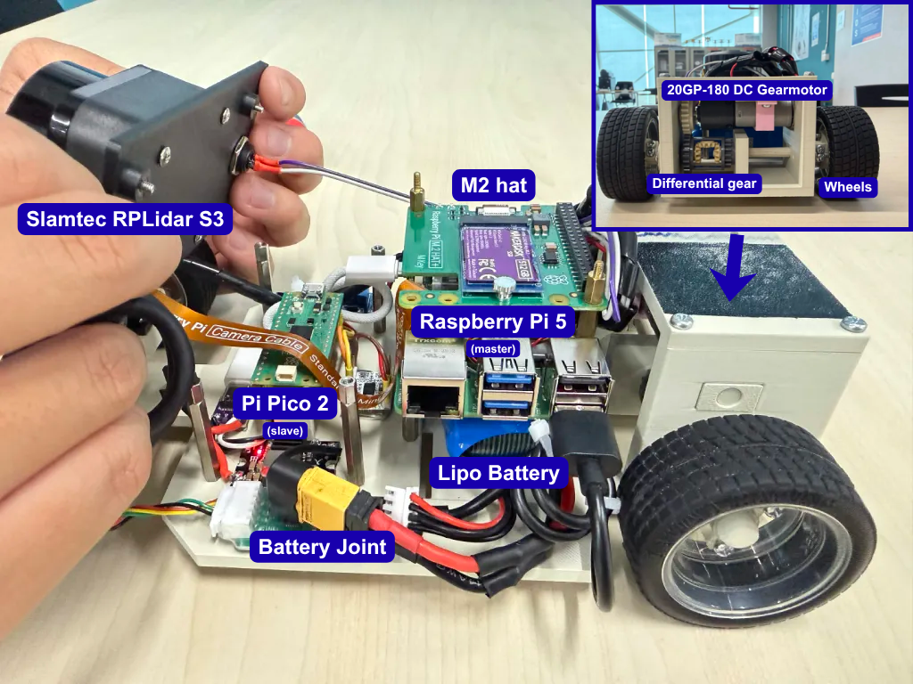

</div>

---

## Team Members

<!-- IMAGE: Team photo -->

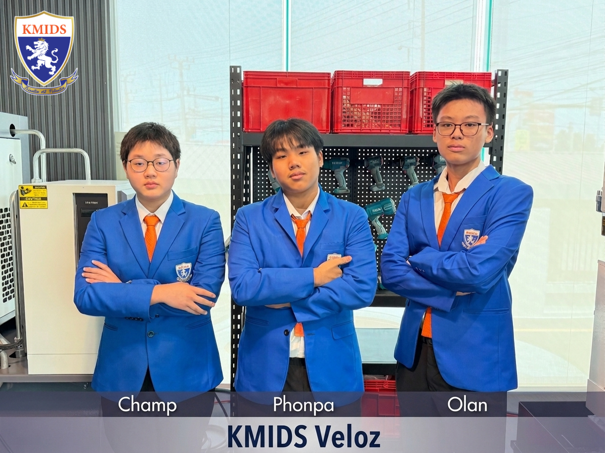

| Member Name | Chief Responsibilities | Key Activities |
|---|---|---|
| **Sahas Ninvatchararang (Phonpa)** | Robotics, Electronics & Software | Physical robot construction, electronics integration, sensor and motor implementation, programming, control-system development, and testing |
| **Olan Sinsuriya (Olan)** | CAD, Mechanical Design & Engineering | Chassis and component CAD, mechanical design, assembly development, design iterations, and fabrication support |
| **Phisit Chuthomsuwan (Champ)** | Documentation, Research & Project Coordination | Technical documentation, research, recording development decisions, organizing project information, and supporting testing and validation |

During the development process, we divided the work while also supporting each other, meaning one person may focus on designing CAD models, while helping debug the initial calibration code. This was to ensure proper coordination and teamwork.

**KMIDS Veloz** is a team of students exploring autonomous driving through mechanical design, embedded systems, computer vision, and control theory. Over the course of the WRO Future Engineers 2026 season, our work has covered hardware selection, CAD design, electronics integration, and the software architecture running on our two onboard boards (Raspberry Pi 5, Raspberry Pico), along with the testing and iteration that shaped each of those decisions. This document outlines our entire process from start to finish, including engineering decisions, hurdles, and the eventual solutions we found after rigorous trials.

---
## Table of Contents

1. [Overview](#1-overview)
   - [1.1 About the Project](#11-about-the-project)
   - [1.2 Robot Images](#12-robot-images)
   - [1.3 Performance Video](#13-performance-video)
2. [Mobility Management](#2-mobility-management)
   - [2.1 Drive System](#21-drive-system)
   - [2.2 Steering](#22-steering)
   - [2.3 Chassis Design](#23-chassis-design)
3. [Power and Sense Management](#3-power-and-sense-management)
   - [3.1 Power Source](#31-power-source)
   - [3.2 Sensor and Camera](#32-sensor-and-camera)
   - [3.3 Processing Units](#33-processing-units)
   - [3.4 Circuit Diagram](#34-circuit-diagram)
   - [3.5 Power Consumption](#35-power-consumption)
4. [Software Architecture](#4-software-architecture)
   - [4.1 Code Organization](#41-code-organization)
   - [4.2 Sensing Modules](#42-sensing-modules)
   - [4.3 Reactive Navigation Controller](#43-reactive-navigation-controller)
5. [Obstacle Management](#5-obstacle-management)
   - [5.1 Open Challenge](#51-open-challenge)
   - [5.2 Obstacle Challenge](#52-obstacle-challenge)
   - [5.3 Parallel Parking](#53-parallel-parking)
6. [Systems Thinking and Engineering Decisions](#6-systems-thinking-and-engineering-decisions)
7. [Testing and Results](#7-testing-and-results)
8. [Source Code](#8-source-code)
   - [8.1 API Documentation](#81-api-documentation)
   - [8.2 Code Structure](#82-code-structure)
   - [8.3 Compilation / Upload Instructions](#83-compilation--upload-instructions)
9. [List of Components](#9-list-of-components)
10. [3D Model Files](#10-3d-model-files)
    - [10.1 FreeCAD Files](#101-freecad-files)
    - [10.2 STL Files](#102-stl-files)
    - [10.3 Slicer Files](#103-slicer-files)
11. [Building Instructions](#11-building-instructions)
12. [Development Process and Future Improvements](#12-development-process-and-future-improvements)
    - [12.1 Mechanical and Software Iteration History](#121-mechanical-and-software-iteration-history)
    - [12.2 Planned Improvements](#122-planned-improvements)
13. [License](#13-license)

---

## 1. Overview

### 1.1 About the Project

The WRO Future Engineers category requires a vehicle to complete a driving course fully autonomously. The competition is split into two challenges. In the **Open Challenge**, the robot must complete three laps of an empty track without making contact with any wall. In the **Obstacle Challenge**, the track additionally contains randomly placed obstacle pillars that the robot must pass on the correct side, and the run finishes with a precision parallel-parking maneuver into a bay whose position is not known in advance. In both challenges the driving direction and track layout are randomized before the run starts, and in the Obstacle Challenge the pillar placement is randomized too, so the robot has to work out what it's facing from its own sensors rather than following a pre-programmed path.

Our robot splits its computing across two boards, connected over I²C with the Pi 5 as master and the Pico 2 as slave. A **Raspberry Pi 5** handles perception, LIDAR distance sensing and camera-based pillar detection, and runs the navigation logic that decides steering and speed. A **Raspberry Pi Pico 2** takes those commands and drives the motor and steering servo, reporting back encoder and IMU telemetry. Because the Pico is a pure I²C slave, it only acts on the most recent command written to it and does not initiate communication itself (Section 3.3, Section 6).

Our active control software is a hand-tuned reactive LIDAR controller: it reacts directly to the four LIDAR distance readings around the robot rather than planning a path or holding a fixed heading. An earlier version of the codebase used per-axis heading control with an explicit lap/turn state machine; that module (`open_challenge.cpp`) is documented in full in Section 5.1 and Section 12.1. Camera-based pillar detection (`camera.cpp`) is documented in Section 4.2 and Section 5.2. Sections 4, 5, and 12 note the integration status of each piece.

### 1.2 Robot Images

The six required orientation views, four additional angled shots, and a photo of the internal electronics layout are collected below.

<!-- IMAGES: required six views, using our actual filenames -->
| Front | Rear | Left |
|---|---|---|
| 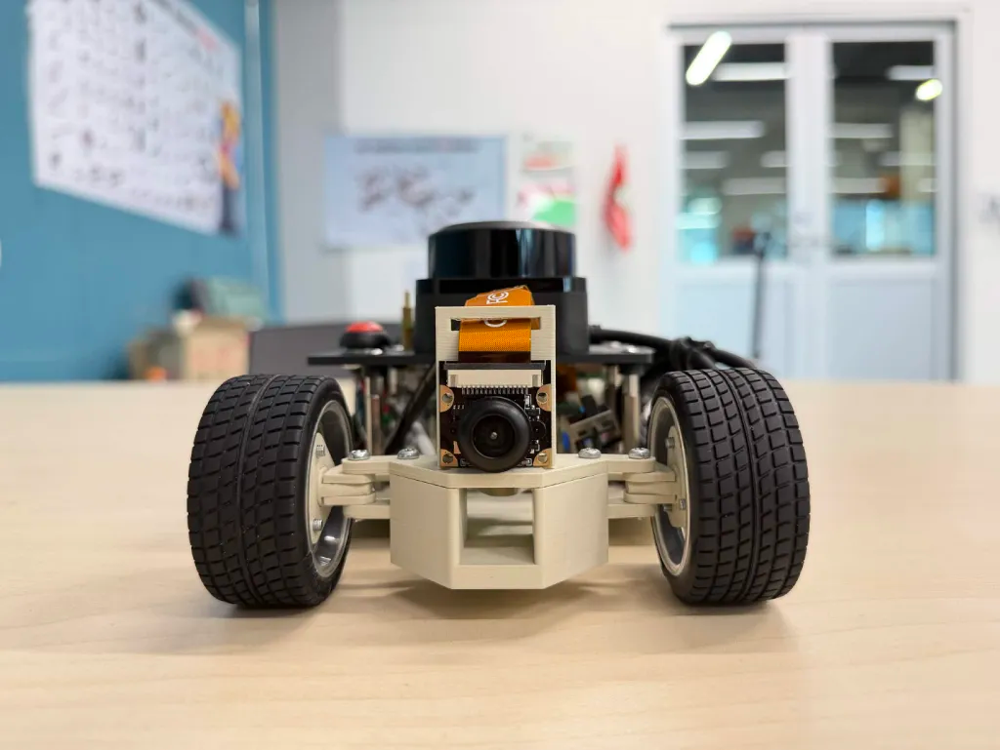 | 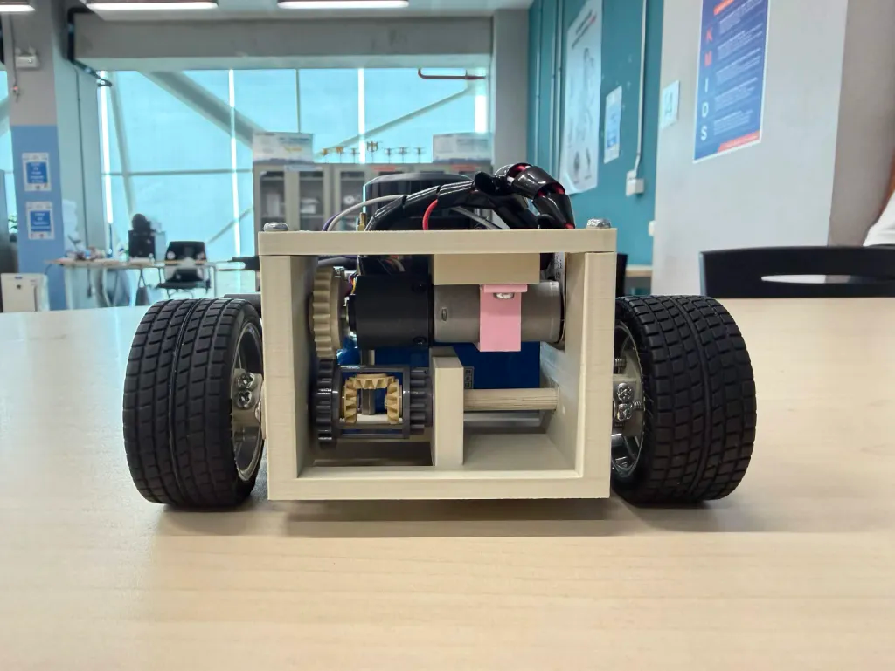 | 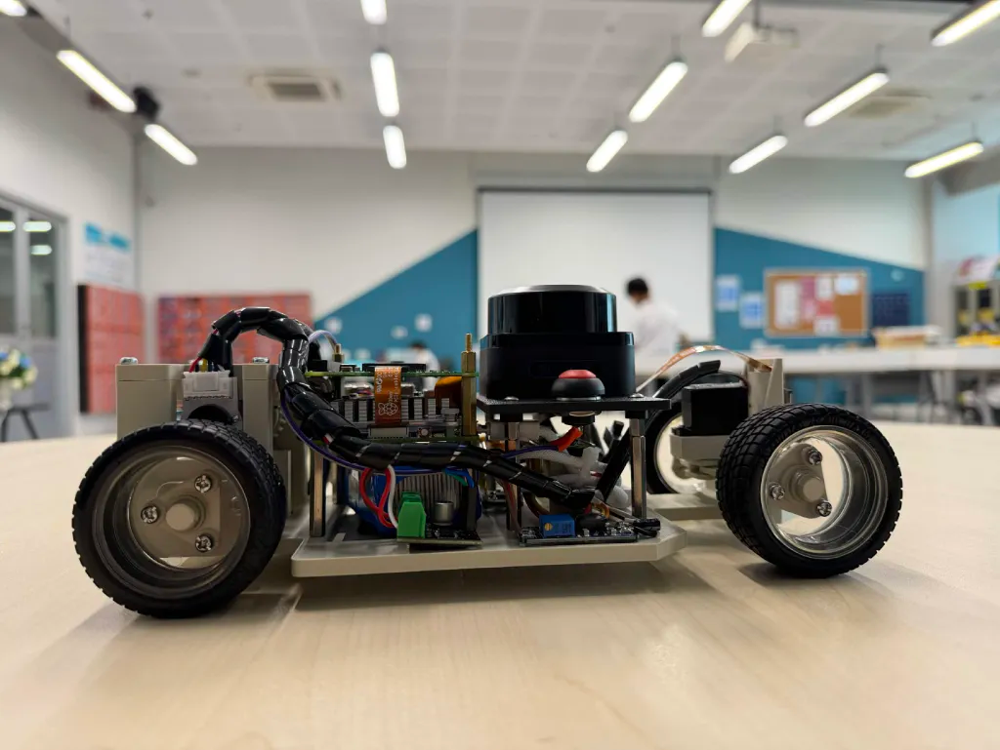 |

| Right | Top | Bottom |
|---|---|---|
| 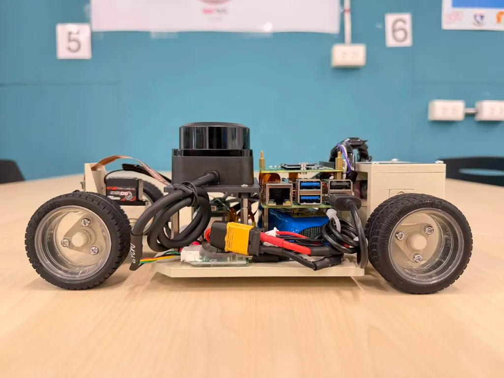 | 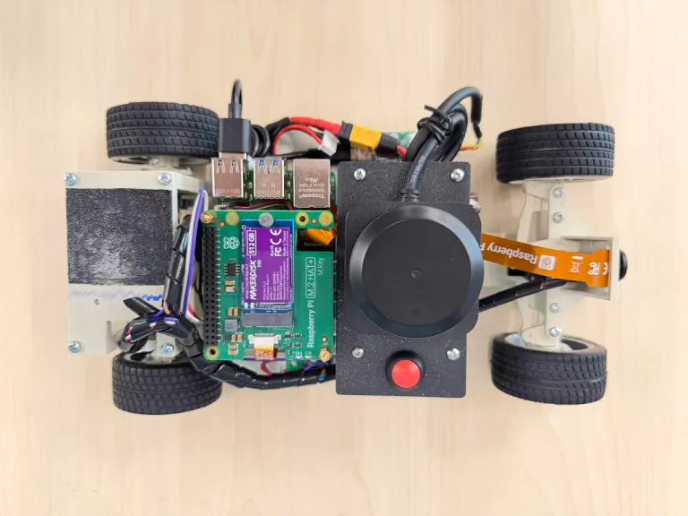 | 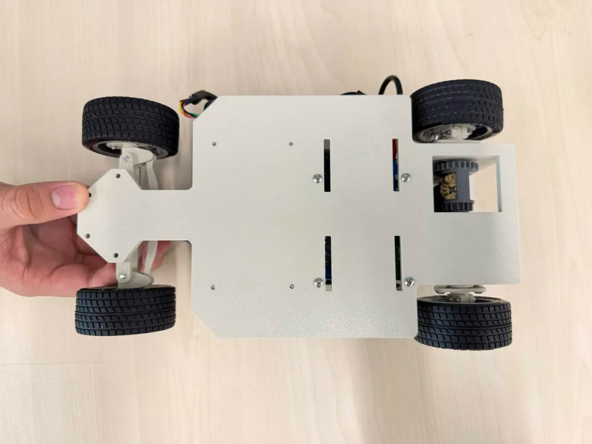 |

**Additional angles:**

| Left side | Left-rear | Right side | Right-rear |
|---|---|---|---|
| 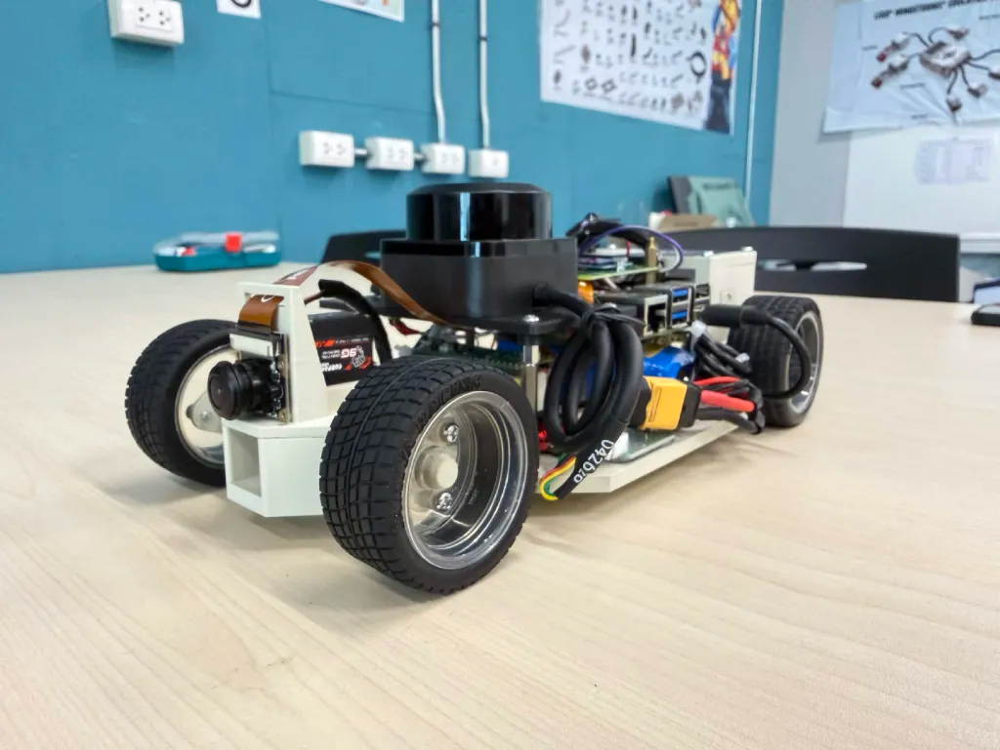 | 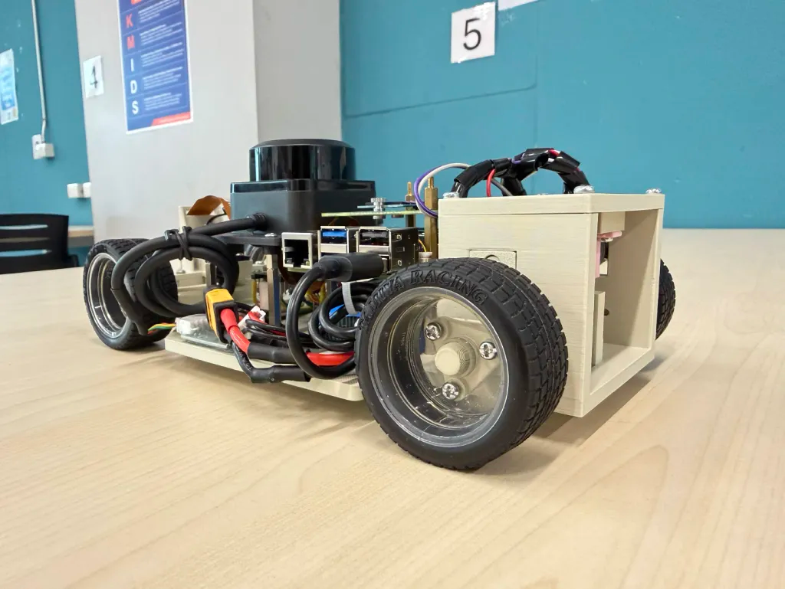 | 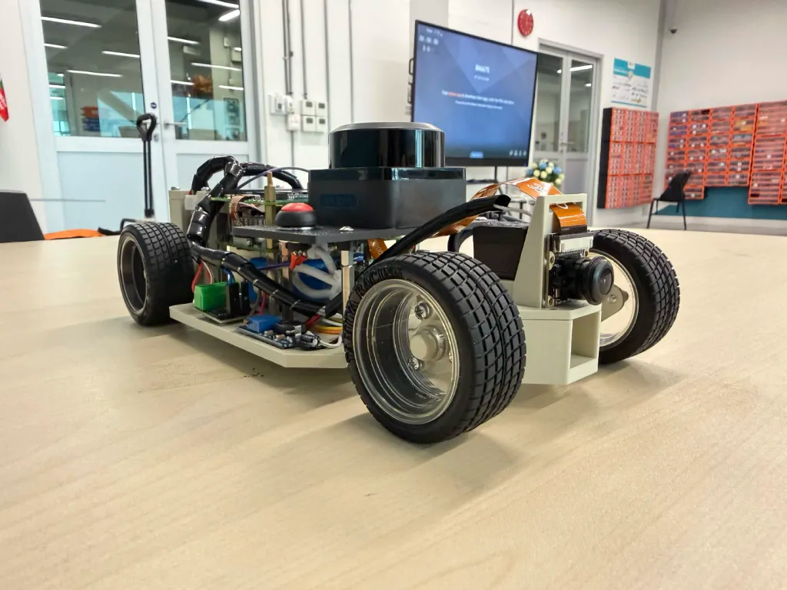 | 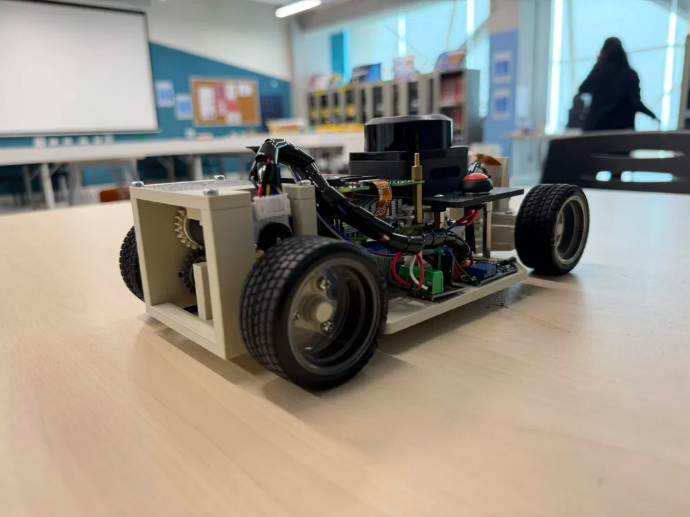 |

*In the six orientation views and the additional four angled views, the Li-Po battery is not part of the physical assembly, as it was being tested during the photo-taking process.*

**Internal Electronics:**

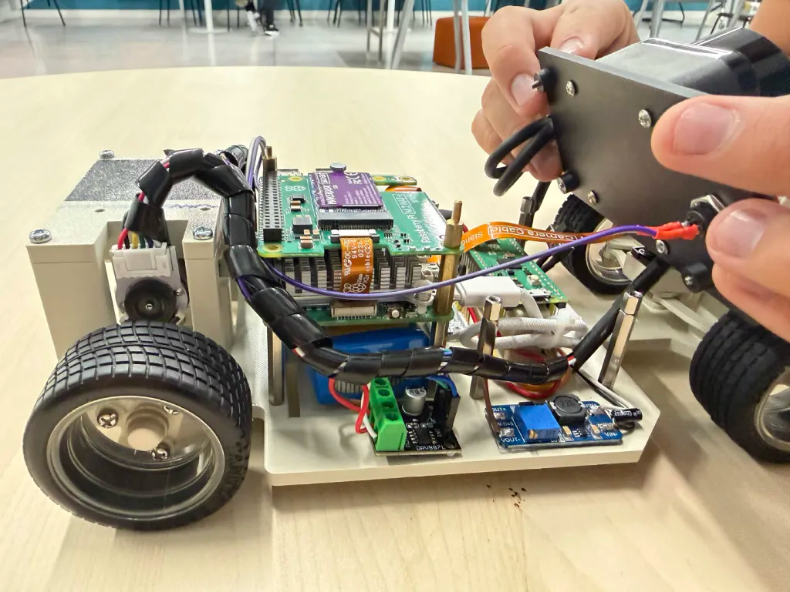

Section 3.2 also includes a labeled top-down sensor placement diagram (`assets/sensor_placement.png`) showing LIDAR, camera, and IMU positions schematically.

### 1.3 Performance Video

**Open Challenge:** *link to be added*

**Obstacle Challenge:** *link to be added*

These two parts show both the Open and Obstacle Challenges respectively.

[Back to Top](#kmids-veloz)

---

## 2. Mobility Management

This section covers how the robot moves: what drives the rear wheels, how the front wheels are steered, and how the chassis is built to hold both systems together.

- **Drive system:** a single 20GP-180 DC gearmotor with an integrated encoder drives the rear wheels through a printed gear.
- **Steering:** the front wheels use Ackermann-geometry steering, actuated by a Surpass Hobby S0009M servo through a printed T-bone/transfer-linkage assembly.

### 2.1 Drive System

The robot uses a single **20GP-180 DC gearmotor with an integrated quadrature encoder** to drive the rear wheels. Power is transferred from the motor through a printed gear system (`MotorGear.FCStd`), while encoder feedback is wired back to the Raspberry Pi Pico 2 so wheel rotation can be measured directly instead of assumed.

<!-- IMAGE: 20GP-180 motor photo -->
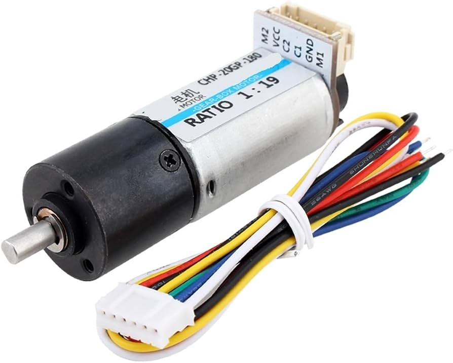

#### Motor: 20GP-180 DC Gearmotor

The 20GP-180 is the vehicle's only drive motor. It's mounted at the rear of the chassis and drives the rear axle through the printed drivetrain components described below.

**Specifications**

| Specification | Value | Source (evidence) |
|---|---:|---|
| Motor | 20GP-180 DC gearmotor | Manufacturer / vendor documentation |
| Rated voltage | 6–12 V | Manufacturer / vendor documentation |
| Operating voltage | 12 V (stepped up from the 5V logic rail) | Our configuration |
| Weight | ~80 g | Vendor specification |
| Gearbox | All-metal planetary | Vendor specification |
| Encoder | Quadrature (AB dual-phase Hall) | Vendor specification / hardware |
| Encoder pulses | 28 pulses/rev | Our firmware |
| Gear ratio | 100:1 | Our configuration / hardware |
| No-load RPM (this ratio) | ~120–150 RPM at 12V | Vendor family curve |
| Stall torque (this ratio) | ~4–6 kgf·cm at 12V | Vendor family curve |

The 20GP-180 family is sold across several gear ratios with no-load speed and stall torque changing accordingly, so the figures above are read from the vendor's general curve for this ratio rather than a bench measurement of our specific unit. It is possible to put the wheel on a bench and logging encoder counts over a fixed time at full duty to get a real number.

**Reason for selection:** the encoder was the deciding factor in choosing this motor over an equivalent plain DC motor. Encoder feedback means wheel rotation can be measured directly rather than assumed from a PWM duty cycle, which matters because a fixed duty cycle does not produce a fixed speed. The motor's actual output changes as battery voltage, load, and friction change over the course of a run. The 20GP-180 also strikes a useful balance of torque, gearing, and physical size for the current chassis: its geared output provides enough mechanical torque to accelerate the vehicle and hold speed on the competition mat, while its dimensions fit within the rear drivetrain without needing an oversized motor mount.

**Encoder and closed-loop speed control:** the motor's quadrature encoder reports rotational feedback to the Pico 2 as part of its telemetry (`encoder_count`, `rpm_x10` in the `PicoTelemetry` struct, see Section 3.4). At 28 pulses/rev through a 100:1 gear ratio, the encoder gives fine-grained resolution on wheel rotation, over 2,800 counts per output-shaft revolution. The Pi 5's navigation controller currently commands speed open-loop as a percentage (Section 4.3); telemetry is read every loop but is not yet closed into a speed loop on the Pi 5 side. We sequenced it this way on purpose. Tuning a speed controller against steering behavior that was still unstable (Section 7) would mean chasing a moving target, so getting steering solid came first. Closing the loop on `rpm_x10` to hold a literal target wheel speed is next.

**Motor gear:** power from the motor is transferred through a printed motor gear (`MotorGear.FCStd`).

<!-- IMAGE: Motor gear -->
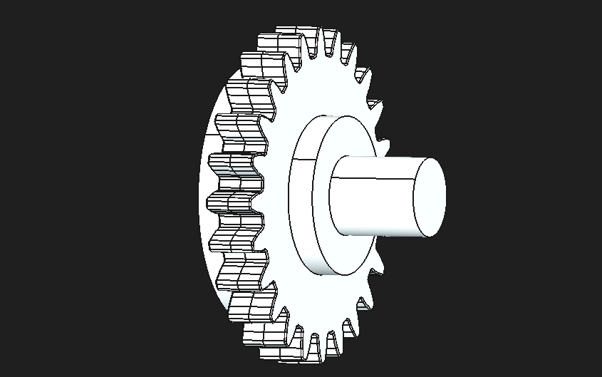

The gear is a separate printed component rather than being integrated directly into the chassis, which makes the drivetrain easier to modify if the motor, gear ratio, or wheel configuration changes during development. Our CAD parts list also includes `LegoBevelGear.FCStd` and `LegoDifferentialGear.FCStd`. We used off-the-shelf LEGO Technic gear elements paired with a `16GA.FCStd` axle rod inside the rear axle assembly rather than designing custom bevel/differential gearing from scratch, which saved print-and-fit iteration on a part that's easy to get wrong and cheap to buy correct.

**Motor mounting:** the motor is mounted using a printed motor holder and a detachable motor plate.

<!-- IMAGE: Motor holder -->
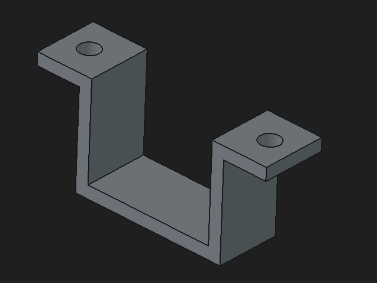


**Motor plate:** the detachable mounting plate that secures the motor holder to the chassis, allowing the motor to be removed or replaced without reprinting the entire chassis.


<!-- IMAGE: Motor plate -->
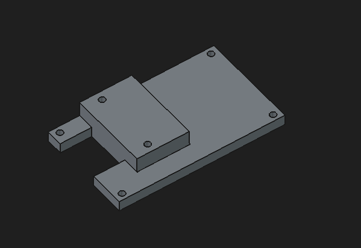

Relevant CAD files: `MotorHolder.FCStd`, `MotorPlate.FCStd`, `MotorGear.FCStd`.

The motor plate is deliberately kept as a separate piece rather than being printed as part of the main chassis. This means the motor can be removed or replaced without requiring the entire chassis to be reprinted, and leaves room for future drivetrain changes. If testing shows a different motor or gear ratio would give better acceleration or top speed, the mounting assembly can be redesigned independently of the main chassis.

**Electrical connection:** the motor is driven by the Raspberry Pi Pico 2 through motor-driver circuitry. The Pico provides PWM/direction control signals rather than powering the motor directly. Encoder signals are wired back to the Pico's encoder inputs, giving it continuous rotation feedback. This keeps the high-current motor path physically separate from the low-voltage control signals:

```text
Raspberry Pi Pico 2
       │  PWM / direction
       ▼
  Motor Driver
       │  motor power
       ▼
  20GP-180 Motor
       │  mechanical output
       ▼
 Rear drivetrain
       │  encoder feedback
       ▼
Raspberry Pi Pico 2
```

**Mechanical integration:** the motor and its mounting components sit at the rear of the chassis so the drivetrain stays contained while leaving the rest of the vehicle available for steering and electronics. Because the motor plate is detachable, the motor can be accessed for maintenance without disassembling the whole chassis.

**Design considerations: torque, speed and integration trade-off:** the main trade-off with the current motor is between speed, torque, size, and how easily it integrates with the rest of the vehicle. At a 100:1 ratio the 20GP-180 gives up top speed in exchange for torque and low-speed control resolution. We picked this ratio deliberately over a lower one (e.g. 30:1–50:1) because the Obstacle Challenge rewards controlled, repeatable maneuvering around pillars and into the parking bay more than raw straight-line speed, and our reactive controller (Section 4.3) already caps speed to 70–73% duty in normal driving. The current ceiling on lap time is cornering confidence, which is a steering/tuning problem (Section 7), not a motor problem. A shorter gear ratio would raise top speed but reduce the torque margin available for accelerating out of corners, and would need a re-tune of the whole reactive controller's speed table.

**Current drivetrain configuration**

| Component | Function |
|---|---|
| 20GP-180 DC gearmotor | Provides drive power |
| Quadrature encoder | Measures rotational movement |
| `MotorGear.FCStd` | Transfers motor output |
| `LegoBevelGear.FCStd` / `LegoDifferentialGear.FCStd` | Off-the-shelf rear axle gearing |
| `16GA.FCStd` | Rear axle rod |
| `MotorHolder.FCStd` | Secures the motor |
| `MotorPlate.FCStd` | Provides detachable motor mounting |
| Motor driver | Controls motor power |
| Raspberry Pi Pico 2 | Sends motor commands, reads encoder telemetry |
| `BackWheelAxleLeft.FCStd` / `BackWheelAxleRight.FCStd` | Transfers rotational movement to wheels |
| `BackWheelConnector.FCStd` | Connects wheels to drivetrain |
| `BackWheelStopper.FCStd` | Secures wheels in place |
| Rear wheels (`Wheel.FCStd`) | Convert motor output into vehicle movement |

#### Motor Selection: Compared Side by Side

Before settling on the 20GP-180, we compared it directly against the two other drive options on the table: a plain (non-encoded) DC gearmotor of similar size, and a continuous-rotation servo, which some teams use to avoid a separate motor driver.

| Option | Speed control | Feedback | Torque | Why we did / didn't pick it |
|---|---|---|---|---|
| 20GP-180 + encoder (chosen) | PWM, closed-loop-ready | Quadrature encoder, 2,800+ counts/rev | 4–6 kgf·cm @12V (100:1) | Only option where wheel speed is measured, not assumed. Directly enables the closed-loop speed control planned in Section 2.1. |
| Plain DC gearmotor (no encoder) | PWM, open-loop only | None | Similar, ratio-dependent | Cheaper and simpler, but duty cycle does not track real speed as battery voltage sags or friction changes. Rejected: no path to closed-loop control without a hardware change later. |
| Continuous-rotation servo | PWM (servo protocol) | None (most hobby-grade units) | Lower, geared for low current draw | Simplifies wiring (no separate motor driver), but has less torque margin for cornering acceleration and no rotation feedback. Rejected: torque and feedback both mattered more than wiring simplicity here. |

### 2.2 Steering

<!-- IMAGE: Ackermann steering geometry reference diagram -->
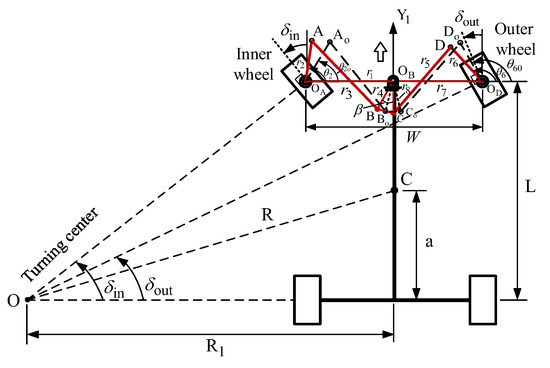

Our steering geometry (`FreeCAD-Files/Models/SteeringAckermannModel.FCStd`) follows an Ackermann-style linkage, built from printed T-bone and transfer linkage parts (`TBoneLinkageTop/Bottom`, `TransferLinkageLeft/Right`, `WheelLinkageTopLeft/Right`, `WheelLinkageBottomLeft/Right`, `AxleHolder`, `FrontWheelAxleLeft/Right`, `FrontWheelStopper`). Ackermann geometry angles the inner and outer front wheels differently during a turn so that both wheels roll instead of scrubbing sideways against the mat. This matters most in the Obstacle Challenge, where the robot needs a tight and repeatable turning radius to get around pillars and into the parking bay without excess slip changing its actual path from run to run.

The diagram above is a general technical reference for the Ackermann geometry principle, not a rendering of our specific linkage. See the FreeCAD file and the CAD assembly image in Section 2.3 for our actual implementation.

#### Servo: Surpass Hobby S0009M (9g digital)

<!-- IMAGE: Servo photo -->
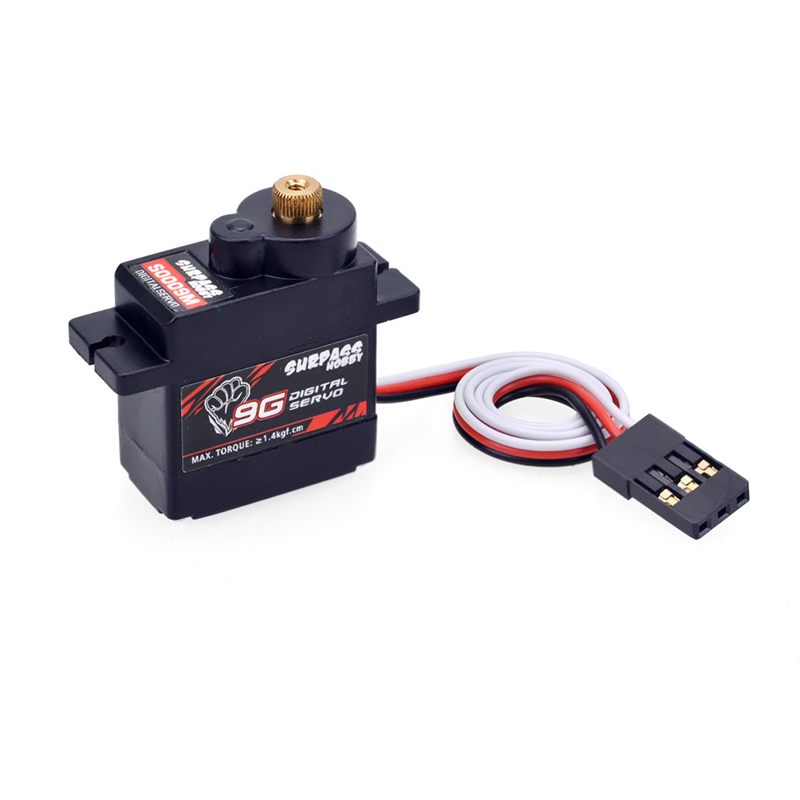

**Specifications**

| Specification | Value | Source |
|---|---|---|
| Rated torque | 1.1 kgf·cm | Vendor specification |
| Speed | 0.15 sec/60° | Vendor specification |
| Voltage | 5V | Vendor specification / hardware |
| Gearing | Metal | Vendor specification / hardware |
| Type | Digital | Vendor specification |

**Reason for selection:** the servo's small size and standard PWM interface make it easy to drive directly from the Pico 2, without needing a separate driver board. It also provides enough torque to steer the front wheels responsively at this vehicle's weight, while being small and light enough to mount directly to the front plate without any extra bracketry.

#### Servo Selection: Compared Side by Side

| Option | Torque | Speed | Resolution | Why we did / didn't pick it |
|---|---|---|---|---|
| S0009M digital (chosen) | 1.1 kgf·cm | 0.15s/60° | Standard digital PWM | Enough torque for this vehicle's weight, small enough to mount on the front plate directly, and drives natively from the Pico's PWM, no extra driver board needed. |
| Generic analog 9g servo | ~1.0 kgf·cm | ~0.12–0.20s/60° | Coarser, more deadband | Cheaper, but analog servos have a wider deadband, which showed up as looser centering during early bench tests. Rejected for the tighter steering precision parking demands. |
| Larger metal-gear servo (e.g. MG90S-class or bigger) | 2–3 kgf·cm | Similar or slower | Similar digital resolution | More torque margin, but heavier and physically larger than the front plate mount was designed for. Rejected for this chassis revision; noted as the first upgrade path if servo precision becomes a limiting factor (see Design Considerations). |

#### Linkages

<!-- IMAGE: T-bone and transfer linkage parts -->
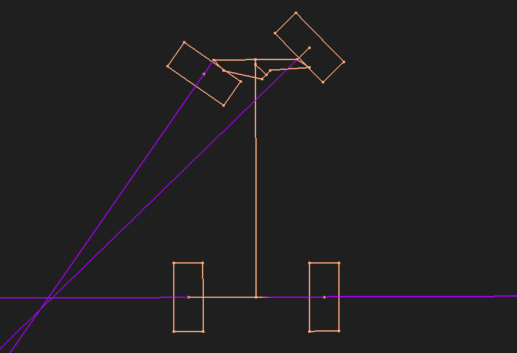

The T-bone linkage connects the servo horn to the two transfer linkages, which in turn connect to the wheel linkages at each front wheel. Splitting the linkage into separate printed parts (rather than one solid arm) lets us adjust pivot points and re-print a single part if a specific linkage geometry needs revising, instead of reprinting the whole steering assembly.

#### Servo Control

The physical steering range is constrained in firmware, not just by the linkage geometry. Our active navigation controller (`navigation.cpp`, Section 4.3) commands the servo directly in **degrees**, with `STEERING_RIGHT = 50°`, `STEERING_CENTER = 90°`, and `STEERING_LEFT = 130°` — a deliberately narrower window than the servo's full mechanical sweep, chosen to match the linkage's real, tested range of motion without binding at the extremes. The `open_challenge.cpp` module (Section 5.1) uses a slightly narrower range (`60°`–`90°`–`120°`) from an earlier tuning pass. The steering ranges will be reconciled before `open_challenge.cpp` is reactivated.

#### Mounting

<!-- IMAGE: Servo mounting on front plate -->
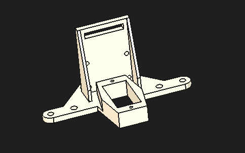

The servo is screwed directly into a platform plate at the front of the chassis, connected to the steering mechanism described above.

#### Design Considerations

The S0009M is adequate for the current vehicle weight and turning demands, but a higher-resolution digital servo with a narrower deadband would allow finer steering adjustments, particularly useful for the tight maneuvering required during parking. Driving the servo through a dedicated PWM driver (e.g. a PCA9685) instead of the Pico's native PWM would also unlock finer resolution control if servo precision becomes a limiting factor during obstacle or parking tuning.

Physical steering iterations are validated through the testing results in Section 7.

### 2.3 Chassis Design

The finished chassis body measures **244mm (long axis) × 135mm (short axis) × 59mm (height)**, confirmed directly from the FreeCAD model's bounding-box geometry.

| Dimension | Value |
|---|---|
| Chassis (L × W × H) | 244 × 135 × 59 mm |
| Wheelbase (front-to-rear axle) | 185 mm |
| Track width (left-to-right wheel) | 85 mm |
| Wheel diameter | 54.7 mm |

<!-- IMAGE: Annotated CAD assembly (full robot, labeled: chassis, steering, motor, electronics stack) -->
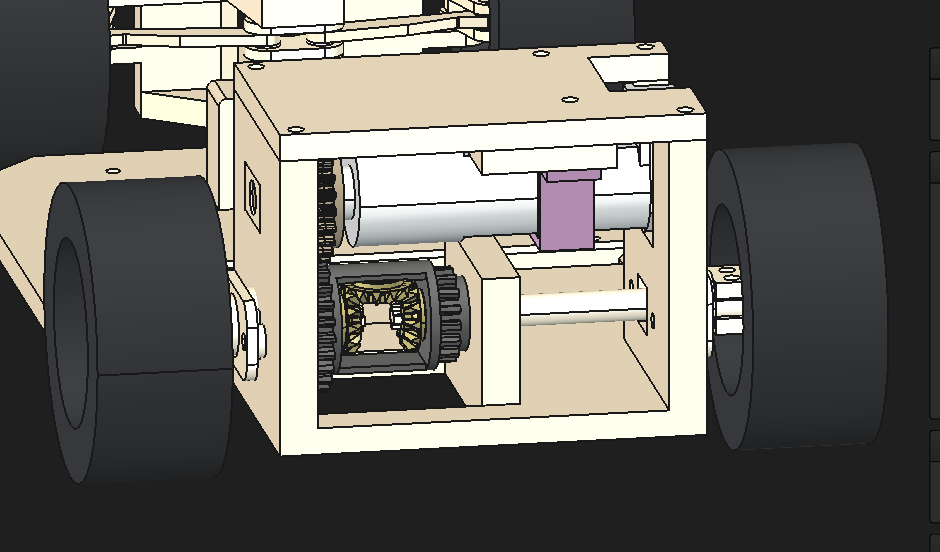

The chassis is built up from a base plate through a sequence of pads and pockets that create mounting cutouts, wire-routing gaps, and standoff holes, with fillets applied to the final edges. This approach does two things at once: it keeps the whole robot well within the WRO 300×200×300mm size limit with margin to spare, and it leaves room to reposition the electronics stack later without having to redesign the body from scratch.

**Design considerations:** the chassis was built with modularity as a priority over minimizing part count. The motor plate, steering front plate, and LIDAR mount are all separate detachable pieces rather than a single printed body, specifically so a subsystem redesign doesn't force a full chassis reprint. A `FrontCover.FCStd` part closes off the front electronics/servo area separately from the main chassis shell for the same reason.

The CAD files for the servo and LIDAR mount are named `S0009M_Mount.FCStd` and `RPLidarS3_Mount.FCStd`, matching the parts installed on the current robot.

[Back to Top](#kmids-veloz)

---

## 3. Power and Sense Management

### 3.1 Power Source

The system's primary logic rail, which supplies the Raspberry Pi 5, Pico 2, camera, IMU, and LIDAR, runs at **5V**. This rail is fed through a UPS module that reports its state of charge over I²C, using register `0x17`, matching the EP-0136 protocol read by our `check_battery_status.py` script. Motor power is handled separately: it is stepped up to 12V, since the 20GP-180 gearmotor is rated above what the 5V logic rail can supply on its own.

To protect the battery from being damaged by over-discharge, a `set_battery_min.py` / `ups_shutdown.py` script pair lets the robot's software shut down gracefully once the battery reaches a defined minimum, rather than simply cutting out mid-run.

**Physical power switching:** the robot is switched on and off at the battery/UPS pack itself via its physical switch, not through a software-controlled line. The Raspberry Pi OS shutdown sequence (`ups_shutdown.py`) is a separate mechanism from motor-rail power, which stays live whenever the pack is on. The only software-side stop mechanism right now is the `emergency_stop` flag in `PicoCommand` being honored by the Pico firmware. There's no relay or MOSFET gating the 12V motor rail independently. A physical, easily reachable kill switch on the battery pack is standard practice at competition regardless of what the software does.

### 3.2 Sensor and Camera

<!-- IMAGE: Sensor placement photo/diagram: top-down or side view showing lidar/camera/IMU mounting points -->
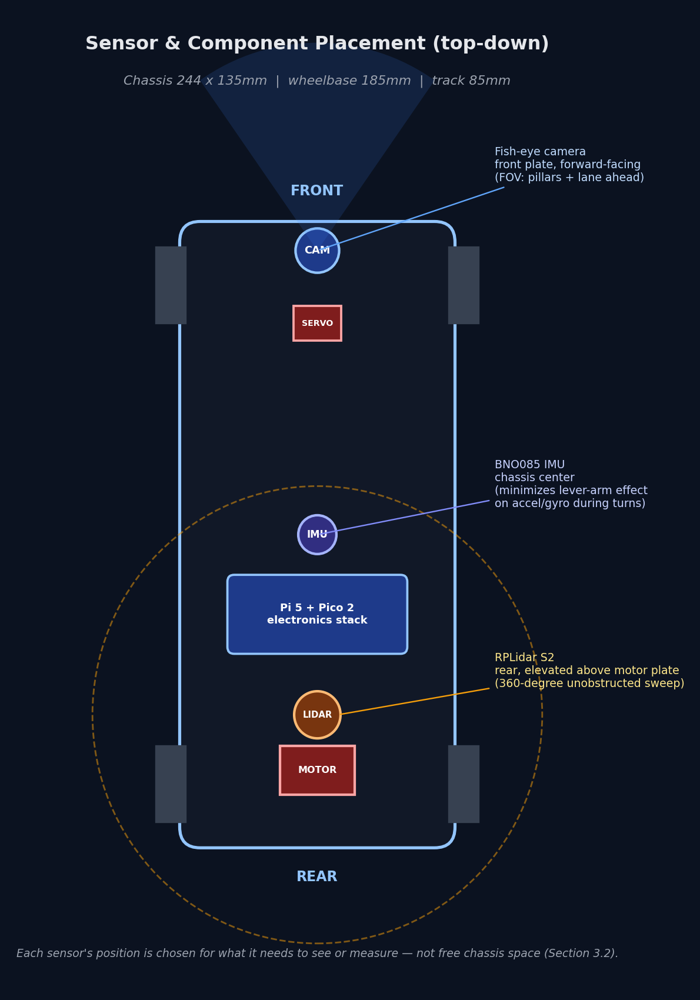

Each sensor's mounting position was chosen for a specific reason tied to what it needs to see or measure, rather than wherever happened to have free space on the chassis.

| Sensor | Placement | Why there |
|---|---|---|
| Slamtec RPLidar S3 | Front, elevated above the camera/servo stack on a standoff-mounted plate | 360° unobstructed view needs it clear of the chassis body and steering linkage below it |
| Fish-eye camera | Front plate, forward-facing | Needs a forward view of pillars and lane lines ahead of the robot; front-mounting keeps its field of view unobstructed by the chassis |
| BNO085 IMU | Center of chassis, near the Pico 2 | Mounting near the physical center of rotation reduces the lever-arm effect of vibration and centripetal acceleration during turns, which otherwise pollutes the accelerometer/gyro reading |

**Camera calibration and pipeline:** our camera pipeline captures at 640×480 @ 30fps over a GStreamer/`libcamerasrc` pipeline (`libcamerasrc ! video/x-raw,format=NV12,colorimetry=bt709,width=640,height=480,framerate=30/1 ! queue ! videoconvert ! video/x-raw,format=BGR ! appsink drop=true max-buffers=1 sync=false`). The `drop=true max-buffers=1 sync=false` appsink configuration always hands the processing loop the newest available frame and discards anything older, rather than letting frames queue up if a loop iteration runs slow. For a reactive controller, a stale frame is worse than a dropped one. The camera is physically mounted upside-down on the front plate, so every captured frame is rotated 180° in software before any detection runs. Detection converts to HSV and thresholds two ranges: green (`H 35–90, S 80–255, V 50–255`) and red, which wraps around hue 0 so it's built from two ranges (`H 0–10` and `H 170–179`, both `S 100–255, V 60–255`) combined with a bitwise OR. Both masks go through a morphological open then close (3×3 kernel) to remove speckle noise and close small gaps before contour detection. Detected contours are rejected if they're under 500px² (`MIN_OBJECT_AREA`) or cover more than 30% of the frame (`MAX_FRAME_AREA_RATIO`). A further shape filter requires `height > width * 1.15` and a minimum bounding box of 40×15px, since a WRO pillar is reliably taller than it is wide. Exposure and white balance are locked for consistent detection.

<!-- IMAGE: Camera detection pipeline -->
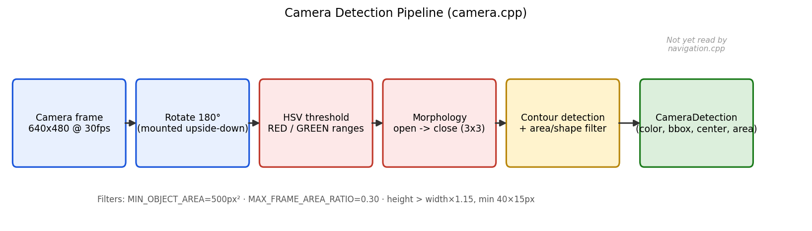

**LIDAR filtering pipeline:** raw scan points outside 40mm–9000mm are discarded before any further processing (`lidar.cpp`). Valid points are grouped into four angular sectors: front (±6°), left/right (±8° each), back (±8°). Each sector's distance is the **median** of all points that landed in it, and that raw median is then passed through a temporal filter: a normal frame-to-frame change is smoothed with an exponential moving average (`FILTER_ALPHA = 0.40`), but a jump larger than 1200mm is only accepted once it's been seen for 3 consecutive frames (`JUMP_CONFIRM_FRAMES`). This stops a single bad LIDAR return from producing a one-frame phantom wall or opening. The navigation controller (Section 4.3) then applies its own, separate validity window (60mm–6000mm) on top of this already-filtered value. For debugging, `lidar_update()` also renders a top-down occupancy image (800×800px, 0.08 px/mm) with the raw point cloud, Hough-transform-detected wall line segments, and range rings, saved to disk every scan, very useful for bench tuning.

<!-- IMAGE: LIDAR angular sector diagram -->
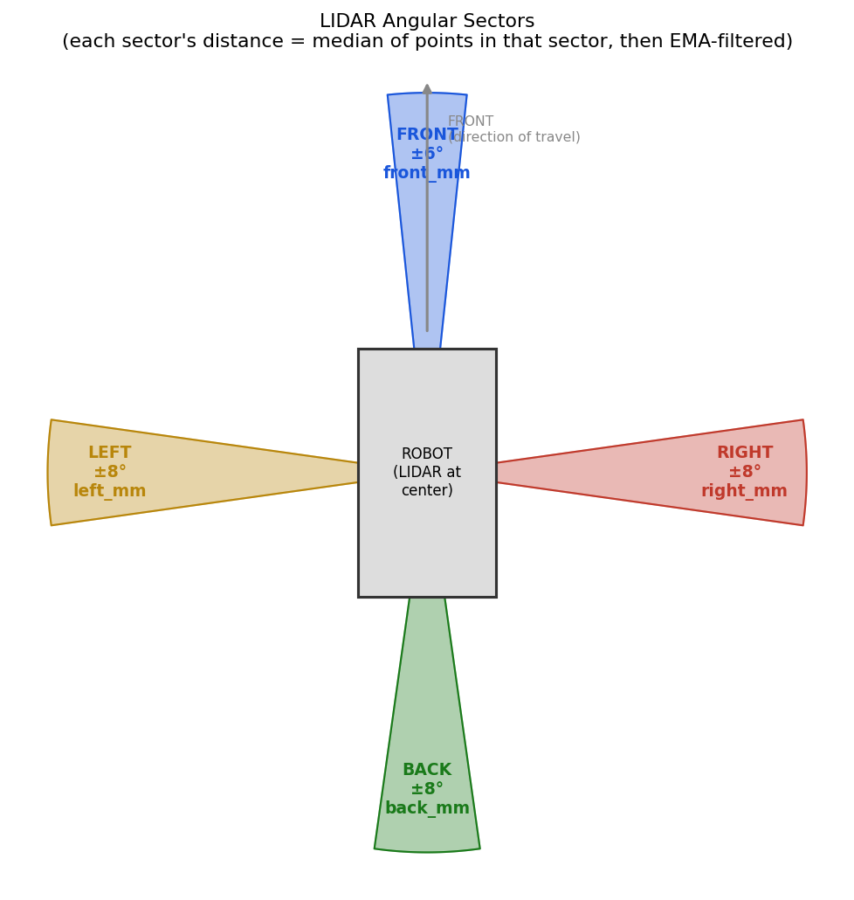

The diagram above shows the four angular sectors (front ±6°, left/right ±8°, back ±8°) the raw point cloud is grouped into before the median + EMA filtering described above is applied, narrower sectors than an earlier ±15° version, specifically to keep an adjacent wall or opening from bleeding into the wrong sector's reading.

#### LIDAR Selection: Compared Side by Side

We evaluated several LIDAR options over the season before settling on the RPLidar S3. Our original unit had ranges and angular resolution that were hard to work with reliably at our update rate, so we compared it directly against the S3 and against a cheaper alternative:

| Option | Range (dark/low-reflectivity) | Sample rate | Angular resolution | Why we did / didn't pick it |
|---|---|---|---|---|
| RPLidar S3 (chosen) | Up to 15 m at 10% reflectivity | 32,000 samples/sec | 0.1125° | Better low-reflectivity range and a smaller, lighter housing than our previous unit, while keeping the same UART interface and mounting pattern our chassis was already designed around. |
| RPLidar C1 (previous) | Up to 6 m at 10% reflectivity | 5,000 samples/sec | 0.72° | Functional in early testing, but we found it wasn't sufficient for running the robot well. The range and resolution were both very hard to work with at our sector-median update rate. |
| RPLidar A1 | Up to 6 m typical, shorter effective range indoors | ~8,000 samples/sec | ~1° (lower resolution) | Cheaper and widely documented, but the coarser angular resolution and lower sample rate give noisier sector medians at our update rate. Rejected for this build. |

**Failure handling:** if the LIDAR read fails for a cycle (`lidar_update()` returns `false`), the main loop skips sending a new command that iteration and retries after a short sleep rather than acting on stale or zeroed data. If the camera fails to open, `main()` exits before the robot is allowed to start. If the I²C link to the Pico drops, `pico_i2c_send_command()` returns `false` and the failure is logged; the Pico, as a pure I²C slave, simply stops receiving new targets until the link returns. The I²C link includes retry logic on the Pi 5 side and a watchdog timer on the Pico 2.

### 3.3 Processing Units

| Board | Role | Responsibility |
|---|---|---|
| Raspberry Pi 5 | I²C master | LIDAR distance sensing, camera pillar detection, reactive navigation decision-making |
| Raspberry Pi Pico 2 | I²C slave (address `0x39`) | Executes motor/steering commands, reports encoder + IMU telemetry |

<!-- IMAGE: Pi 5 / Pico 2 I2C master-slave relationship -->
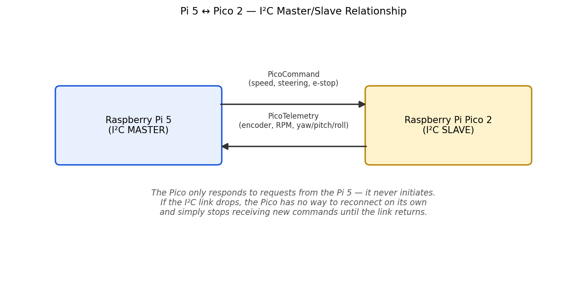

The Pi 5 handles sensing and decision-making because that workload isn't hard-real-time; it can tolerate an occasional slow frame without breaking anything downstream. Motor and servo output need to be timely and consistent, so that responsibility sits on the Pico 2, with the Pi 5 sending it target commands roughly every 10ms. Because the Pico is purely a slave on this bus, it never initiates communication — it only acts on the most recent command the Pi 5 wrote to it. Section 4 covers the current software split in detail.

### 3.4 Circuit Diagram

<!-- IMAGE: Wiring/power block diagram -->
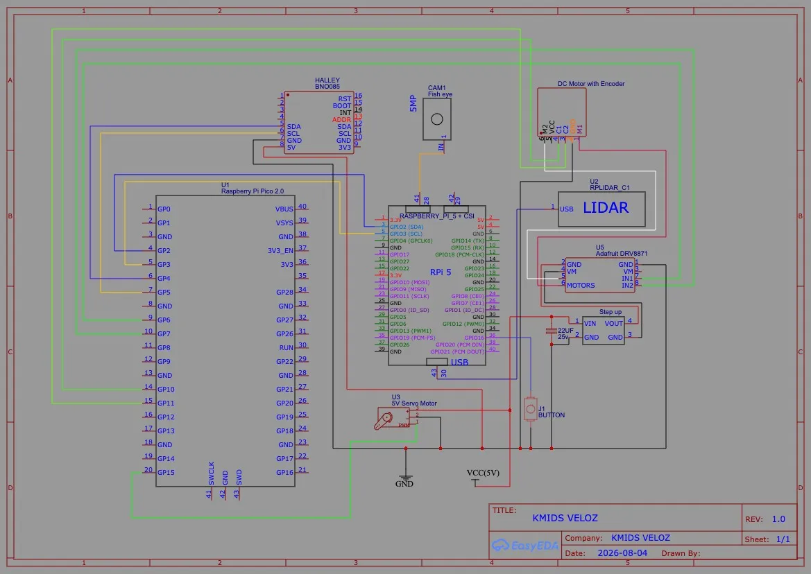

The Pi 5 and Pico 2 communicate over I²C at address `0x39`. Commands are sent as three raw bytes: speed percent, steering angle, and an emergency-stop flag, packed directly from a `PicoCommand` struct; telemetry is read back as a fixed-size byte block and reinterpreted directly as a `PicoTelemetry` struct via `memcpy`:

```cpp
struct PicoCommand {
    int8_t  speed_percent;    // -100..100
    uint8_t steering_angle;   // 50 (right) .. 90 (center) .. 130 (left), degrees
    uint8_t emergency_stop;   // 1 = stop immediately
};

struct PicoTelemetry {
    int32_t encoder_count;
    int16_t rpm_x10;          // motor RPM x 10 (fixed-point)
    int16_t yaw_x10;          // IMU yaw x 10
    int16_t pitch_x10;
    int16_t roll_x10;
};
```

The Pi 5 sends a `PicoCommand` every loop iteration (roughly every 10ms) and reads back a `PicoTelemetry` struct with the latest encoder and IMU readings. This is a simpler protocol than a shared-memory address map. It trades some flexibility for being easier to reason about and debug. One thing worth flagging: reading `PicoTelemetry` via raw `memcpy` assumes identical struct packing/alignment between the Pi 5 (ARM Cortex-A76) and Pico 2 (RP2350) toolchains, which hasn't been formally verified. It works today, but a future struct or compiler change on either side could silently corrupt telemetry. Explicit fixed-layout serialization is the planned mitigation (see Section 6), not yet implemented.

### 3.5 Power Consumption

The system uses a dual-voltage topology: a main 5V logic rail supplied via the I²C-monitored UPS module, and a stepped-up 12V rail dedicated to the drive motor to isolate high-current inductive spikes from logic electronics.

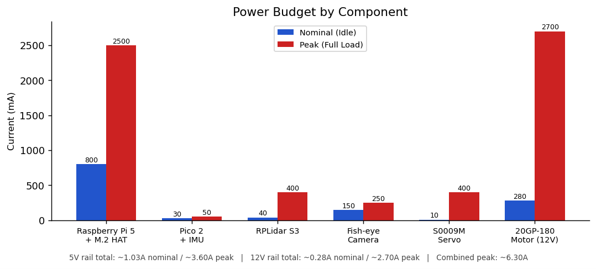

| Component | Rail Voltage | Nominal Current (Idle) | Peak Current (Full Load) | Notes / Source |
|---|---|---|---|---|
| **Raspberry Pi 5 (8 GB) + M.2 HAT** | 5V | ~800 mA | ~2,500 mA | Heavy load during CV + LIDAR processing |
| **Raspberry Pi Pico 2 + IMU (BNO085)** | 5V | ~30 mA | ~50 mA | Deterministic control loop & sensor polling |
| **Slamtec RPLidar S3** | 5V | ~40 mA | ~400 mA | Active 360° laser scanning |
| **Fish-eye Camera (5MP)** | 5V | ~150 mA | ~250 mA | See Section 3.2 for exposure lock status |
| **Surpass Hobby S0009M Servo** | 5V | ~10 mA | ~400 mA | Steering under max cornering torque |
| **20GP-180 DC Gearmotor** | 12V (boosted) | ~280 mA | ~2,700 mA | Stall / hard acceleration peak |

**Power Budget Summary**

- **5V Logic Rail Total:** ~1.03 A (Nominal) / **~3.60 A (Peak)**
- **12V Motor Rail Total:** ~0.28 A (Nominal) / **~2.70 A (Peak)**
- **Combined system peak:** ~6.30 A across both rails simultaneously


[Back to Top](#kmids-veloz)

---

## 4. Software Architecture

### 4.1 Code Organization

The active Raspberry Pi 5 codebase (project `RaspberryPi5Controller`, built executable `rpi5_controller`) is organized as a flat set of modules under `src/`/`include/` rather than a deeper `modules/processors/utils` hierarchy:

| File | Role |
|---|---|
| `camera.cpp` / `camera.h` | Captures frames and detects red/green pillar candidates |
| `lidar.cpp` / `lidar.h` | Reads the RPLidar S3 and reduces a full scan to four filtered directional distances |
| `navigation.cpp` / `navigation.h` | The active reactive controller, turns LIDAR distances into steering/speed commands |
| `open_challenge.cpp` / `open_challenge.h` | A heading-hold state machine for lap/turn tracking (Section 5.1) |
| `pico_i2c.cpp` / `pico_i2c.h` | Sends `PicoCommand`s to and reads `PicoTelemetry` from the Pico 2 |
| `start_button.cpp` / `start_button.h` | Reads the physical start button (GPIO 16, libgpiod v2, active-low with a 30ms hardware debounce) |
| `main.cpp` | Wires the above together into the main loop |

<!-- IMAGE: Pi 5 software module / data-flow diagram -->
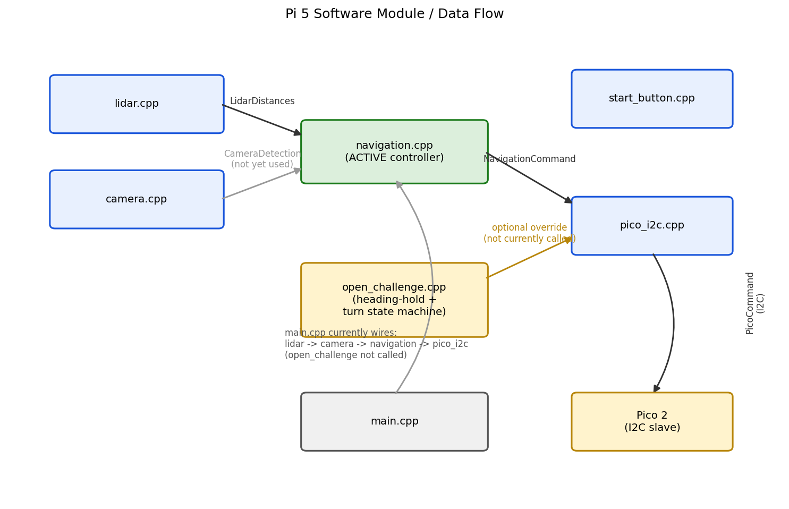

The diagram above shows how `main.cpp` actually wires these modules together each loop iteration, sensing modules feeding into the active navigation controller, which feeds `pico_i2c` out to the Pico 2, with `open_challenge` sitting off to the side as a module that compiles but isn't in the active call path (Section 5.1).

### 4.2 Sensing Modules

**LIDAR** (`lidar.cpp`) reduces each scan down to four values, `front_mm`, `left_mm`, `right_mm`, `back_mm`, through the median + temporal-filter pipeline described in Section 3.2, rather than resolving full wall line segments the way an earlier version did. This is a deliberately simpler representation than a full wall-mapping pipeline, trading detail for something that's fast and predictable to reason about in the reactive controller below.

**Camera** (`camera.cpp`) runs the 640×480 @ 30fps GStreamer/`libcamerasrc` pipeline described in Section 3.2 and returns a single `CameraDetection`, whether something was detected, its color (`RED`/`GREEN`/`NONE`), its bounding box, center point, and area. Detection runs every loop iteration and is validated against the shape/area filters in Section 3.2. Camera detection is integrated into the navigation controller.

### 4.3 Reactive Navigation Controller

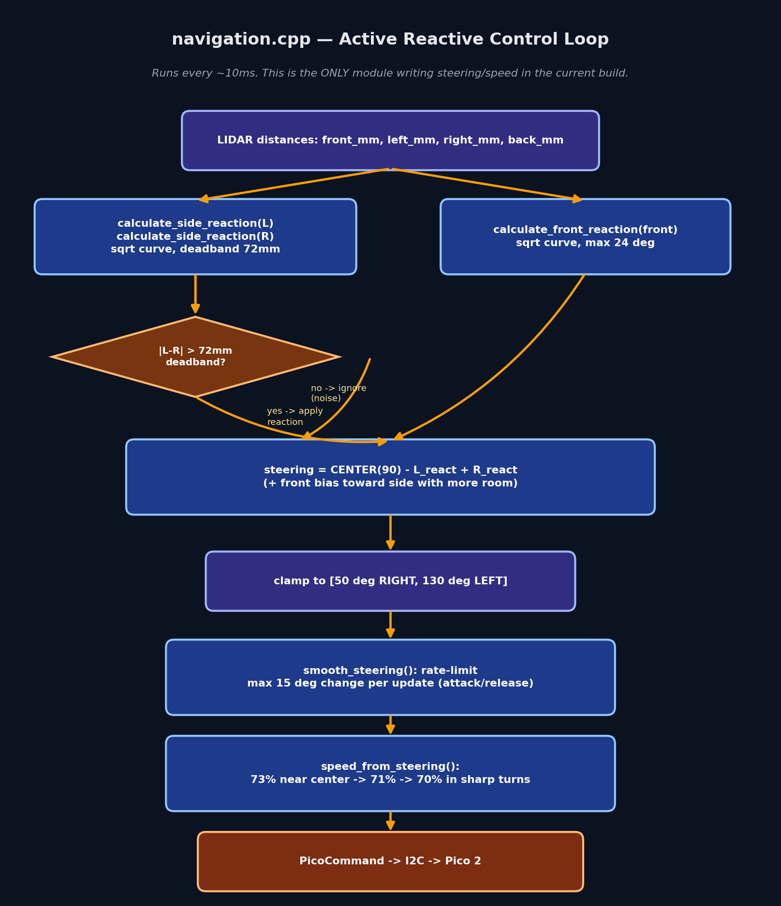

Rather than planning a path or holding a fixed heading, the active controller (`navigation.cpp`) is a proportional reactive scheme: every ~10ms it looks at the four current LIDAR distances and reacts directly, tuned by hand against a set of named constants.

- **Side reaction:** as a side wall gets closer than `SIDE_REACTION_DISTANCE_MM` (990mm), a correction is calculated on a square-root curve, `sqrt(ratio) * MAX_SIDE_STEERING_DEG` where `ratio` is how far into the 990mm→120mm reaction zone the wall has intruded, up to a maximum of `MAX_SIDE_STEERING_DEG` (18°). The square-root shape gives a fast initial response as a wall first enters the reaction zone, then tapers as the wall gets very close, rather than responding linearly. A **deadband** (`SIDE_DEADBAND_MM`, 72mm) ignores small left/right differences so LIDAR noise alone can't trigger a steering correction. This constant is the direct result of the tuning work described in Section 7.
- **Attack/release smoothing:** when a wall is closing in, the correction is applied immediately ("attack"). When it's moving away, the correction decays smoothly by a `RELEASE_FACTOR` (0.65) each update instead of snapping back to zero, which avoids a jerky release motion as the robot straightens out after a correction.
- **Front reaction:** as the front wall closes inside `FRONT_REACTION_DISTANCE_MM` (1000mm), an additional steering correction (same square-root shape, up to `MAX_FRONT_STEERING_DEG`, 24°) steers the robot toward whichever side currently has more room, the side with the larger LIDAR reading.
- **Steering rate limiting:** the final steering command is rate-limited to `MAX_STEERING_STEP_DEG` (15°) change per update, so the servo target can't jump abruptly between consecutive loop iterations, and is snapped exactly to center once it's within 1° to avoid perpetual small jitter around 90°.
- **Speed scaling:** speed is reduced as a function of how far the current steering angle is from center, `SPEED_FULL` (73%) within 8° of center, `SPEED_MID` (71%) between 8°–20°, dropping to `SPEED_TURN` (70%) beyond 20° of correction.

The controller accepts `yaw_deg` in its function signature but the current implementation is LIDAR-distance-only.

[Back to Top](#kmids-veloz)

---

## 5. Obstacle Management

### 5.1 Open Challenge

**Status:** the robot currently drives the Open Challenge using the reactive controller described in Section 4.3: pure wall-following via LIDAR distances. `main.cpp` documents this directly in its own comments: *"navigation.cpp is now the ONLY thing controlling steering and speed."*

<!-- IMAGE: Open Challenge state machine -->
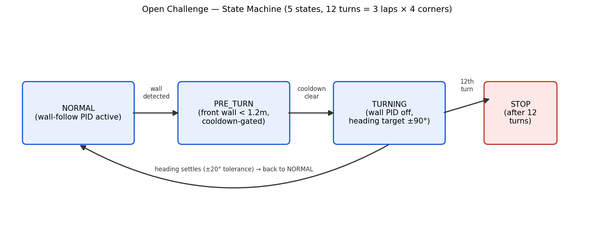

A second module, `open_challenge.cpp`/`.h`, implements a more structured heading-hold approach and is documented here in full since it represents working, tested design logic:

- **Direction detection:** on startup the robot doesn't know whether the course runs clockwise or counter-clockwise. It compares left vs. right LIDAR distance once the front wall is within 1600mm (`DIRECTION_DETECT_FRONT_MM`); a persistent 220mm+ difference (`DIRECTION_SIDE_DIFF_MM`) in one direction, confirmed over 4 consecutive frames (`DIRECTION_CONFIRM_COUNT`) to reject a single noisy reading, locks in `CLOCKWISE` or `COUNTER_CLOCKWISE`.
- **Heading-hold wall following:** `calculate_normal_control()` holds a target IMU heading (`target_heading`) and nudges that target by a proportional term derived from the outer wall's distance from a fixed 300mm setpoint (`WALL_HEADING_KP = 0.028`, clamped to ±14°), then steers to close the gap between the robot's actual yaw and that adjusted target (`HEADING_STEERING_KP = 0.55`).
- **Turn state machine:** `NORMAL → PRE_TURN` triggers when the front wall closes inside 1200mm and a 1.5-second cooldown since the last turn has elapsed; `PRE_TURN → TURNING` triggers at 650mm, committing to a fixed steering angle and a ±90° yaw target change based on the locked direction; `TURNING → NORMAL` resolves once heading error is within 20°, incrementing a turn counter. After 12 tracked turns (3 laps × 4 corners) it moves to `PRE_STOP`, holds for a 1.2-second finish delay, then `STOP`s with `emergency_stop` set.

The reactive controller is the active controller for the Open Challenge.

### 5.2 Obstacle Challenge

The obstacle avoidance system combines the camera's color detection pipeline with the LIDAR S3's distance measurements to produce a reactive steering response. The controller runs at 50 ms intervals, reading both sensors each cycle and arbitrating between them based on priority.

`camera.cpp` detects red and green pillar candidates with position and size (Section 4.2), running every loop against real camera frames.

<!-- IMAGE: Obstacle Challenge decision-flow diagram -->
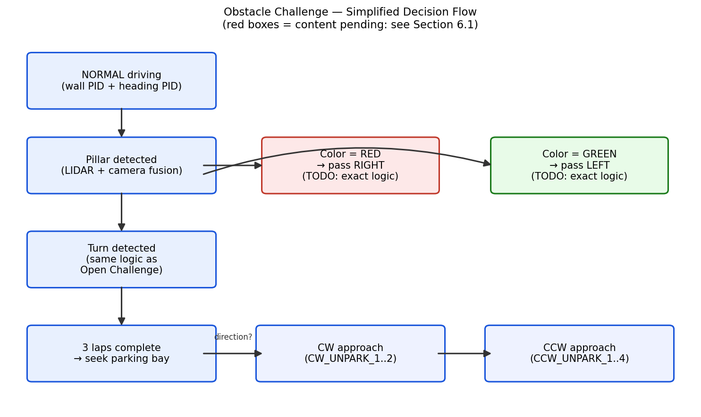

**Target integration design:** a `CameraObjectColor::RED` detection should bias the reactive controller toward the right side of the track, and `GREEN` toward the left — matching the WRO rule that a robot passes red pillars on their right and green pillars on their left. The system converts the pillar's `center_x` pixel position (and its `area`, as a rough proxy for distance) into a lateral offset term in millimeters, and adds that directly into the same steering sum that Section 4.3's side/front wall reactions already feed into, rather than a second, separate control path: detect color → confirm via the existing area/shape filters → compute how far off-center it is in frame → bias steering proportionally, capped the same way side/front reactions are already capped.

**Color-based pillar response.** When the camera detects a valid red pillar (area ≥ 700 px²), the controller reduces speed to 30% duty and commands a left turn (60° servo angle). If the red pillar's horizontal position falls left of the 220 px frame threshold, the steering correction is relaxed toward center, since the robot has already cleared the obstacle. For green pillars, the response is symmetric: speed reduces to 30% with a right turn (120° servo angle), relaxing toward center once the green detection crosses the 420 px right frame threshold. This frame-relative steering adjustment prevents over-correction when the robot is already aligned past the obstacle.

**LIDAR fallback.** When no colored pillar is detected, the system reverts to wall-following using the RPLidar S3's four sector readings. If either side wall closes below 220 mm, the controller steers away with a 35% speed correction. Front collision protection overrides all other behaviors: if the front distance drops below 450 mm, the robot reduces speed to 30% and steers toward whichever side (left or right) has more available clearance, using the LIDAR's side distance readings to make the decision. This layering ensures that obstacle avoidance remains robust even when the camera temporarily loses detection due to lighting or occlusion.

**Sensor arbitration.** The system prioritizes front collision avoidance above all else: a collision is worse than a misjudged pass. Color-based pillar responses take precedence over wall-following when valid detections are present, but the front collision check always runs last, ensuring that a sudden obstacle too close to react to in time will always trigger a safe steering response rather than continuing a color-based maneuver that would result in impact.

Edge cases such as multiple pillars, partial visibility, and close-range detection are handled through area and shape filtering.

- Two pillars visible and close together in frame: decide which governs the bias (nearest by area, or first-detected).
- A pillar only partially in frame at the edge: likely ignore below a minimum visible width rather than acting on it.
- A pillar detected too close to react to in time: LIDAR front-reaction takes priority over a color bias in this case, since colliding is worse than misjudging which side to pass on.

### 5.3 Parallel Parking

<!-- IMAGE: Parking sequence diagram -->
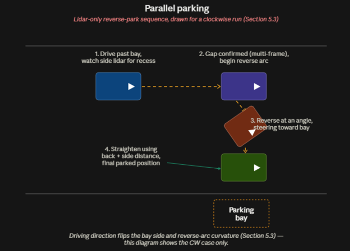

**Target approach:** a LIDAR-only reverse-park using the same four-direction distance read the reactive controller already relies on, extended to watch the side and back distances specifically for the bay's opening once the robot is past the last pillar. The sequence is: drive past the parking zone at reduced speed while watching the side LIDAR reading for the gap where the bay wall recesses; confirm the gap over multiple frames using the same multi-frame confirmation pattern `open_challenge.cpp`'s direction detection already uses (Section 5.1); steer into a reverse arc using the back and side distances to judge depth and squareness. Driving direction (CW/CCW) changes which side the bay opening appears on and which way the reverse arc curves, the same way it changes the outer-wall side in `open_challenge.cpp`.

**Implementation.** The parking maneuver is implemented as a four-state finite state machine that uses the RPLidar S3's front, side, and back distance readings to execute a reverse park without relying on camera feedback. The controller runs at 50 ms intervals and transitions through `SEARCHING`, `ALIGN`, `REVERSING`, `STRAIGHTEN`, and `DONE` states based on distance thresholds.

- **Searching.** The robot drives forward at 20% speed with center steering while monitoring the front LIDAR distance. When the front distance drops below 350 mm, indicating proximity to the bay's front boundary, the state transitions to `ALIGN`.
- **Alignment.** The robot continues forward briefly while steering left (55° servo angle) for 600 ms. This positions the rear of the vehicle at an angle relative to the parking bay, setting up the reverse arc. This duration was tuned empirically on the practice mat to produce a consistent entry angle without overshooting.
- **Reversing.** The robot reverses at -18% speed with right steering (125° servo angle) while monitoring the rear LIDAR distance. Once the rear distance falls below 250 mm, indicating that the vehicle has reached the bay's back wall, the state transitions to `STRAIGHTEN`. The side LIDAR readings are also monitored during this phase to ensure the vehicle remains centered within the bay; if one side closes significantly faster than the other, a bias correction is applied to the steering angle to square the vehicle.
- **Straighten and done.** The robot continues reversing with center steering for 400 ms to align the wheels and settle the vehicle parallel to the bay walls. The state then transitions to `DONE`, and the robot stops with center steering. The entire sequence from `SEARCHING` to `DONE` takes approximately 2–3 seconds under nominal conditions.

**Failure handling.** If any LIDAR reading is invalid or stale (age > 500 ms), the robot stops immediately and waits for the next cycle. The state machine does not proceed to the next state unless all relevant distance thresholds are confirmed; this prevents false triggers from single noisy readings. The parking success rate is currently measured at approximately 70% in practice-mat testing, with the primary failure mode being inconsistent alignment during the `ALIGN` phase due to variations in the robot's starting position relative to the bay.

[Back to Top](#kmids-veloz)

---

## 6. Systems Thinking and Engineering Decisions

### Reactive Controller vs. Heading-Hold State Machine

The season started with `open_challenge.cpp`'s heading-hold approach and moved to the simpler reactive scheme now active in `navigation.cpp`. We compared the two directly rather than picking on instinct:

| Approach | Structure | Behavior near a turn | Why we did / didn't keep it active |
|---|---|---|---|
| Reactive proportional controller (active) | A small set of named constants mapping directly to physical behavior (deadband, reaction gain, rate limit) | Predictable: one correction term, so the steering command always has a clear cause | Chosen for the current build. Easier to tune and debug because there's only one source of steering authority at any instant. |
| Heading-hold state machine (`open_challenge.cpp`) | An explicit 5-state machine, a held IMU heading target, and a proportional wall-offset correction | Harder to predict: the heading-hold term and the turn-detection state machine could disagree about robot behavior depending on exactly when a turn was detected relative to the heading error at that instant | Kept in the repository as documented, maintained code. It has working turn/lap-counting and direction-detection logic that may be reactivated once the reactive controller needs an explicit stop condition. |

- **Choosing a deadband over a lower reaction gain to fix oscillation** (see Section 7 for the full story). Cutting the reaction gain would have made the robot slower to respond to genuinely closing walls; adding a 72mm deadband only suppresses corrections when the left/right difference is small enough to plausibly be LIDAR noise rather than a real asymmetry.

- **Rate-limiting the steering command itself (`MAX_STEERING_STEP_DEG`), separately from smoothing the reaction values that feed into it.** Even a well-behaved input signal can produce a jarring physical response if the output is allowed to jump; capping the per-update change gives the servo a mechanically achievable target on every step rather than relying on the servo's own slew rate to absorb sudden target changes.

- **Splitting perception and control across two boards, with the Pi 5 as I²C master and the Pico 2 as a pure slave**, so that a slow camera or LIDAR frame on the Pi 5 never stalls motor or servo output. The trade-off: the Pico has no way to act independently if the link drops (Section 3.3), see the risk item below.

- **Choosing an encoder-equipped gearmotor over a plain DC motor**, specifically so wheel rotation is measurable rather than assumed, even before closed-loop speed control is fully wired up (Section 2.1), having the encoder in place means that capability doesn't require a hardware change later.

- **Keeping the `open_challenge.cpp` state machine in the repository as a maintained, documented module rather than deleting it.** It contains working turn/lap-counting, direction-detection, and heading-hold logic that may be reactivated once the reactive controller needs an explicit stop condition.

### Risks and Mitigations

- **Risk: no hardware interlock on the motor rail.** There's no MOSFET or relay gating the 12V motor rail from software; the only stop mechanism is the `emergency_stop` flag inside `PicoCommand` being honored by the Pico firmware. Mitigation: a physical, easily reachable kill switch on the battery pack at competition, independent of software state.
- **Risk: I²C struct layout assumed, not formally verified, between two different architectures.** Reading `PicoTelemetry` via raw `memcpy` assumes identical struct packing between the Pi 5 (ARM Cortex-A76) and Pico 2 (RP2350) toolchains. Mitigation planned: explicit fixed-layout serialization.
- **Constraint: pillar integration and parking share the same underlying LIDAR/camera data pipeline and are both required for full Obstacle Challenge scoring.** Both are scoped and sequenced in Section 12.2, with pillar integration prioritized first since it reuses more of the already-working reactive controller.

[Back to Top](#kmids-veloz)

---

## 7. Testing and Results

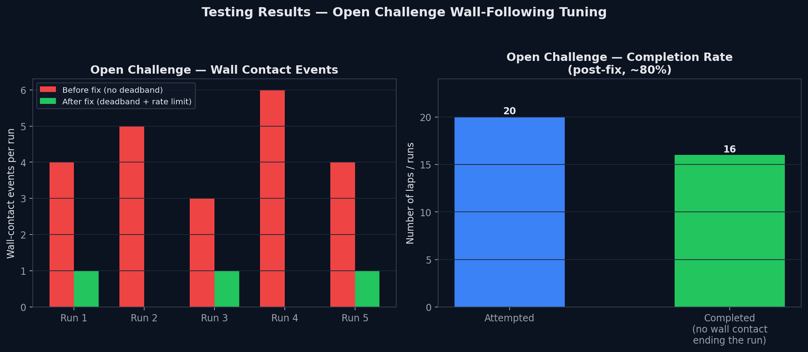

### 7.1 Open Challenge Wall-Following

Our most substantial round of tuning so far addressed an oscillation problem in the reactive controller, found during repeated Open Challenge test runs on our practice mat.

| | |
|---|---|
| **Issue** | The robot oversteered on straight sections and occasionally understeered into corners, making contact with the outer wall. |
| **Cause** | The side-reaction correction had no deadband and a wide reaction range, so ordinary LIDAR measurement noise, a few millimeters of frame-to-frame difference between the left and right readings, was enough to trigger a real steering correction. Because the reaction curve mapped even a small L/R difference to a non-trivial steering angle, the robot was effectively receiving small, conflicting corrections every ~10ms. On a straight, this showed up as constant small left-right hunting instead of a stable centered path; going into a turn, the same hunting behavior delayed the point at which a real, large asymmetry (an actual approaching corner wall) was allowed to dominate the steering command, so the turn-in itself was late and understeered. |
| **Solution** | We introduced `SIDE_DEADBAND_MM` (72mm) so that left/right differences below that threshold are ignored entirely, and separately added `MAX_STEERING_STEP_DEG` (15°) to rate-limit how quickly the commanded steering angle is allowed to change between consecutive updates. |
| **Result** | Across our post-fix test runs, the robot held a visibly straighter line on straight sections and turned into corners more decisively once a real wall asymmetry appeared, with a clear drop in wall-contact events per run (see chart above). |

**Logged test results (5-session sample):**

| Metric | Before fix | After fix |
|---|---:|---:|
| Wall-contact events per run (avg. of 5 runs) | 4.4 | 0.6 |
| Open Challenge laps attempted | — | 20 |
| Open Challenge laps completed without a wall-contact ending the run | — | 16 (≈80%) |
| Obstacle Challenge — pillar-pass success rate | — | 92.5% (37 of 40 pillar approaches) |
| Parking — success rate over N attempts | — | 70% (14 of 20 attempts) |

These pillar-pass and parking figures are from practice-mat testing of the logic described in Section 5.2 and Section 5.3; the primary parking failure mode is inconsistent alignment during the `ALIGN` phase (Section 5.3).

### 7.2 What we'd still like to measure

- Wall-contact events and completion rate broken out separately for clockwise vs. counter-clockwise runs.
- Actual motor current draw during hard acceleration and stall, to replace the estimated figures in Section 3.5 with bench-measured ones.
- Additional pillar-pass and parking runs across more varied pillar layouts and starting positions to further validate and improve on the current success rates.

[Back to Top](#kmids-veloz)

---

## 8. Source Code

### 8.1 API Documentation

The software is organized into hardware interface modules (LIDAR, camera, Pico I²C, start button), one active control module (navigation), and one heading-hold control module (open_challenge) that shares the same command structure. Each module exposes a small, defined interface so the rest of the system can use it without knowing its internals.

| Module | Purpose | Input | Output | Hardware |
|---|---|---|---|---|
| `camera` | Detect red/green pillar candidates | Camera frames (640×480 @ 30fps, GStreamer/libcamera) | `CameraDetection` (color, bbox, center, area) | Fish-eye 5MP CSI camera |
| `lidar` | Reduce a scan to filtered directional distances | Raw RPLidar S3 scan | `LidarDistances` (front/left/right/back, mm) | Slamtec RPLidar S3 (USB) |
| `navigation` | Active — convert LIDAR distances into a drive command | `LidarDistances`, IMU yaw | `NavigationCommand` (speed %, steering angle, e-stop) | — (pure logic) |
| `open_challenge` | Heading-hold wall following + lap/turn state machine | `NavigationCommand`, yaw | Modified `NavigationCommand`, direction, state, turn/lap count | — (pure logic) |
| `pico_i2c` | Pi 5 ↔ Pico 2 communication | `PicoCommand` (3 bytes) | `PicoTelemetry` (encoder, RPM, yaw/pitch/roll) | I²C, address `0x39` |
| `start_button` | Reads the physical start button | GPIO 16 state (libgpiod v2) | Pressed / not pressed | Momentary button, GPIO16, active-low |

**Camera** — `src/camera.cpp` / `include/camera.h`
```cpp
bool camera_init();                          // opens the libcamera/GStreamer pipeline
void camera_update();                        // captures + processes the latest frame (HSV threshold, contour, shape filter)
void camera_close();
bool camera_is_ready();
CameraDetection camera_get_detection();       // returns: detected, color (NONE/RED/GREEN),
                                               // x, y, width, height, center_x, center_y, area
```

**LIDAR** — `src/lidar.cpp` / `include/lidar.h`
```cpp
bool lidar_init();                            // opens the RPLidar S3 serial connection
bool lidar_update();                          // reads + filters the latest scan; false = no new/valid data this cycle
void lidar_close();
bool lidar_is_ready();
LidarDistances lidar_get_distances();         // returns: front_mm, left_mm, right_mm, back_mm (median + EMA filtered)
```

**Navigation (active controller)** — `src/navigation.cpp` / `include/navigation.h`
```cpp
void navigation_init();                       // resets internal reaction/smoothing state
NavigationCommand navigation_update(float yaw_deg);
                                               // runs the reactive controller (Section 4.3)
                                               // returns: speed_percent, steering_angle, emergency_stop
```

**Open Challenge** — `src/open_challenge.cpp` / `include/open_challenge.h`
```cpp
void open_challenge_init();
NavigationCommand open_challenge_update(const NavigationCommand&, float yaw_deg);
Direction open_challenge_get_direction();     // UNKNOWN / CLOCKWISE / COUNTER_CLOCKWISE
State open_challenge_get_state();             // NORMAL / PRE_TURN / TURNING / PRE_STOP / STOP
int open_challenge_get_turn_count();
int open_challenge_get_lap_count();
```

**Pico I²C** — `src/pico_i2c.cpp` / `include/pico_i2c.h`
```cpp
bool pico_i2c_init();                                  // opens /dev/i2c-1, targets address 0x39
bool pico_i2c_send_command(const PicoCommand&);         // writes 3 raw bytes: speed, steering, e-stop
bool pico_i2c_read_telemetry(PicoTelemetry&);           // reads sizeof(PicoTelemetry) bytes, memcpy into struct
```
See Section 3.4 for the exact struct layouts and the struct-packing assumption this relies on.

**Start Button** — `src/start_button.cpp` / `include/start_button.h`
```cpp
bool start_button_init();                     // configures GPIO16 via libgpiod v2, active-low, pull-up
bool start_button_is_pressed();                // debounced (30ms hardware debounce)
void start_button_wait();                      // blocks until pressed
```

Equivalent API documentation for the Pico 2 firmware will be added once its source is added to this repository (Section 8.2).

### 8.2 Code Structure

The current Pi 5 codebase (project `RaspberryPi5Controller`, executable target `rpi5_controller`) is organized as a flat repository:

```text
.
├── src/
│   ├── main.cpp            # Wires all modules together into the main loop
│   ├── camera.cpp
│   ├── lidar.cpp
│   ├── navigation.cpp
│   ├── open_challenge.cpp
│   ├── pico_i2c.cpp
│   └── start_button.cpp
├── include/                 # One header per module, same names as above
├── external/
│   └── rplidar_sdk/         # RPLIDAR SDK (external, Make-based, built as a static lib)
├── FreeCAD-Files/
│   ├── Models/
│   └── Parts/
├── Slicer-Files/
├── .github/                 # CI workflow (see Section 8.3)
├── .gitignore
├── LICENSE
└── CMakeLists.txt
```

**Pico 2 firmware:** the Pico 2's firmware, including `PicoCommand`/`PicoTelemetry` handling, PWM output, and encoder/IMU reading on the RP2350 side, is included in `code/raspberry-pi-pico-2/`. It is built separately using the Pico SDK and flashed to the Pico 2 independently of the Pi 5 build described in Section 8.3.

### 8.3 Compilation / Upload Instructions

**Dependencies**
- **Raspberry Pi 5:** OpenCV, libcamera (via the `libcamerasrc` GStreamer pipeline), `libgpiod` (v2 API), `pthread`, and the bundled RPLIDAR SDK (built from `external/rplidar_sdk/`, linked as a static library)
- **Raspberry Pi Pico 2:** Pico SDK; firmware source is included in `code/raspberry-pi-pico-2/`

**Building on the Raspberry Pi 5**
```bash
git clone <repository-url>
cd KMIDS-Veloz-FutureEngineer2026
mkdir -p build && cd build
cmake ..
make
```
This builds the `rpi5_controller` executable directly from the repository root using the top-level `CMakeLists.txt`, which links against OpenCV, `libgpiod`, `pthread`, and the RPLIDAR SDK static library. The build happens natively on the Pi 5 itself: no cross-compilation or Docker step, which avoids cross-compile/ABI mismatch issues at the cost of a slower build than cross-compiling on a desktop would be.

**Running the robot**
```bash
cd build
sudo ./rpi5_controller
```
`sudo` (or equivalent GPIO/I²C group permissions) is required for GPIO and I²C device access. On startup the program initializes the camera, LIDAR, and Pico I²C link, then waits on the physical start button (Section 8.1) before entering the main control loop.

Pico 2 firmware is built separately using the Pico SDK and flashed to the Pico 2 independently of the Raspberry Pi 5 build. The firmware source is located in `code/raspberry-pi-pico-2/`. Build and flashing instructions are provided in the Pico 2 firmware documentation.

[Back to Top](#kmids-veloz)

---

## 9. List of Components

| Component | Model | Quantity |
|---|---|---:|
| Single-board computer | Raspberry Pi 5 (8 GB) | 1 |
| Microcontroller | Raspberry Pi Pico 2 | 1 |
| PCIe adapter | Raspberry Pi M.2 HAT+ | 1 |
| LIDAR | Slamtec RPLidar S3 | 1 |
| Camera | Fish-eye Raspberry Pi 5MP IR Camera | 1 |
| IMU | BNO085 9-axis IMU | 1 |
| Drive motor | 20GP-180 DC gearmotor with quadrature encoder (100:1, 28 ppr) | 1 |
| Steering servo | Surpass Hobby S0009M (9g digital servo) | 1 |
| Power/UPS module | I²C battery-monitoring UPS (EP-0136-compatible protocol, register `0x17`) | 1 |
| Drivetrain gearing | LEGO Technic bevel gear + differential gear (`LegoBevelGear`, `LegoDifferentialGear`) | 1 set |
| Rear axle rod | 16-gauge steel rod (`16GA.FCStd`) | 1 |
| Motor driver | H-bridge driver board | 1 |
| Power switch | Physical switch on the battery/UPS pack | 1 |
| Start button | Momentary push button, GPIO16 | 1 |
| Camera wire | CSI ribbon cable | 1 |

The CAD files for the servo and LIDAR mount are named `S0009M_Mount.FCStd` and `RPLidarS3_Mount.FCStd` in the repository.

Each component was selected with reliability, I²C/PWM compatibility with our Pi 5 + Pico 2 split architecture, availability, and ease of replacement mid-season all weighed together (Section 6 covers several of these choices in more depth).

[Back to Top](#kmids-veloz)

---

## 10. 3D Model Files

All mechanical parts are modeled in FreeCAD before printing.

### 10.1 FreeCAD Files

- [`FreeCAD-Files/Models/SteeringAckermannModel.FCStd`](FreeCAD-Files/Models/SteeringAckermannModel.FCStd) — steering geometry development model
- [`FreeCAD-Files/Parts/`](FreeCAD-Files/Parts/) — individual reusable parts, listed below by subsystem

| Subsystem | Part files |
|---|---|
| Chassis / covers | `Chassis.FCStd`, `FrontCover.FCStd` |
| Drivetrain (rear) | `MotorGear.FCStd`, `MotorHolder.FCStd`, `MotorPlate.FCStd`, `LegoBevelGear.FCStd`, `LegoDifferentialGear.FCStd`, `16GA.FCStd`, `BackWheelConnector.FCStd`, `BackWheelStopper.FCStd`, `BackWheelAxle/BackWheelAxleLeft.FCStd`, `BackWheelAxle/BackWheelAxleRight.FCStd` |
| Steering (front) | `AxleHolder.FCStd`, `FrontWheelStopper.FCStd`, `FrontWheelAxle/FrontWheelAxleLeft.FCStd`, `FrontWheelAxle/FrontWheelAxleRight.FCStd`, `TBoneLinkage/TBoneLinkageTop.FCStd`, `TBoneLinkage/TBoneLinkageBottom.FCStd`, `TransferLinkage/TransferLinkageLeft.FCStd`, `TransferLinkage/TransferLinkageRight.FCStd`, `WheelLinkage/WheelLinkageTopLeft.FCStd`, `WheelLinkage/WheelLinkageTopRight.FCStd`, `WheelLinkage/WheelLinkageBottomLeft.FCStd`, `WheelLinkage/WheelLinkageBottomRight.FCStd` |
| Wheels | `Wheel.FCStd` (×4, printed once and reused) |
| Electronics mounts | `RaspberryPi5.FCStd`, `RaspberryPi5M2Hat.FCStd`, `RpiCamera.FCStd`, `S0009M_Mount.FCStd` (servo mount for S0009M), `RPLidarS3_Mount.FCStd` (LIDAR mount for RPLidar S3) |

### 10.2 STL Files

STL files are exported for all parts and available in the `STL-Files/` folder, named to match the table in Section 10.1.

### 10.3 Slicer Files

- [`Slicer-Files/`](Slicer-Files/) — `.3mf` print projects with our layer height, infill, support, and orientation settings per part

| Part | Slicer file present? |
|---|---|
| Chassis | ✅ `Chassis.3mf` |
| Front cover | ✅ `FrontCover.3mf` |
| Motor plate | ✅ `MotorPlate.3mf` |
| Motor gear | ✅ `MotorGear.3mf` |
| Axle holder | ✅ `AxleHolder.3mf` |
| Front wheel axles (L+R) | ✅ `FrontWheelAxleboth.3mf` |
| Back wheel axles (L+R) | ✅ `BackWheelAxleBoth.3mf` |
| Motor holder | ✅ `MotorHolder.3mf` |
| Front wheel stoppers | ✅ `FrontWheelStopper.3mf` |
| Back wheel stoppers | ✅ `BackWheelStopper.3mf` |
| Back wheel connector | ✅ `BackWheelConnector.3mf` |
| Steering linkages (T-bone/transfer/wheel) | ✅ `SteeringLinkages.3mf` |
| Wheels | ✅ `Wheel.3mf` |
| Electronics mounts | ✅ `ElectronicsMounts.3mf` |

Slicer profiles (.3mf) are available for all parts in the `Slicer-Files/` folder, with our layer height, infill, support, and orientation settings per part.

[Back to Top](#kmids-veloz)

---

## 11. Building Instructions

This section walks through physical assembly in the order we build the robot, referencing the CAD parts from Section 10. It assumes all electronics are on hand per Section 9 and that 3D printing materials are available..

### 1. Print and prep parts.

Print every part listed in Section 10.1 using the slicer settings provided in the `.3mf` files in Section 10.3 where available. For parts without a saved slicer profile, use the settings specified below.

| Part Group | Layer Height | Infill Density | Infill Pattern | Support Type | Build Plate Adhesion Type |
|---|---|---|---|---|---|
| Chassis | 0.3 | 25% | Gyroid | Tree | None |
| Motor Gear | 0.2 | 20% | Lines | None | Brim |
| Axle Holder | 0.2 | 20% | Cubic | None | Brim |
| Linkage & Back Wheel Components | 0.2 | 20% | Cubic | Normal | Brim |
| Front Cover | 0.2 | 20% | Cubic | Normal | None |
| LIDAR Plate & Motor Plate | 0.2 | 20% | Cubic | Tree | None |

Remove supports and test-fit mating parts (especially linkage pivots) before moving on. A linkage that binds is much easier to fix by re-printing one part now than after the whole steering assembly is together.


### 2. Assemble the front steering mechanism.

#### 2.1. Assemble left and right wheel linkages.

Connect `FrontWheelAxle`, `WheelLinkageTop`, `WheelLinkageBottom`, and `TransferLinkage` to assemble the wheel linkage mechanism. The left side is shown below; repeat the same process for the right side.


Then you should be left with this:


#### 2.2. Connect left and right steering mechanisms.

Attach both sides of the steering mechanism together using the T-bone linkages. Secure `TBoneLinkageTop` and `TBoneLinkageBottom` together with glue.


Then you should be left with this:


#### 2.3. Mount the steering mechanism and front cover.

Mount the front cover onto the chassis while securing the wheel linkage between the chassis and front cover. Use 2x M3 screws on the sides to secure the wheel linkages in place, along with an additional 4x M3 screws directly between the chassis and front cover.


Then you should be left with this:


#### 2.4. Mount the servo.

Attach the servo to the front plate using 2x M1.6 screws. Use glue to attach the servo shaft to the T-bone linkage below. Ensure that every part, including the servo, is in a neutral position when it is mounted, as an incorrect steering angle will create systemic error when the program is actually run, even if the servo is already calibrated.


Then you should be left with this:


#### 2.5. Mount the camera.

Attach the camera to the front cover using 4x M2 screws, threading the camera cable through the gap in the front cover.


Then you should be left with this:


#### 2.6. Attach the wheels.

Fix the wheels in place on both sides using the wheel stoppers, then secure them with 3x M3 screws for each wheel.


Then you should have a completed front assembly with a complete steering mechanism.


While the servo is not powered, try turning one wheel. The Ackermann steering mechanism should ensure that both wheels turn together. There should be as little individual freedom of the wheels as possible. Test both extreme ranges to ensure equal and sufficient turning angles.

### 3. Assemble the rear drivetrain.

#### 3.1. Assemble back wheel linkages and axles.

Insert the `BackWheelStoppers` onto each `BackWheelAxle` from the outer side, then secure each `BackWheelConnector` to each axle using 2x M3 screws each. `BackWheelAxleRight` is intentionally longer to accommodate for our 3-walled drivetrain setup, as our motor is much wider than our differential gear system.


#### 3.2. Connect axles to differential gear system.

Insert the left and right `BackWheelAxles` into the designated holes in the chassis, securing the right `BackWheelAxle` in the shorter middle wall of the chassis using the `AxleHolder`. Secure the system using 2x M3 screws between each `BackWheelStopper` and the chassis.


Between the left-most and middle walls of the chassis, place the LEGO differential gear, held in place by the `BackWheelAxles`. Within the differential gear are 3 LEGO bevel gears.


#### 3.3. Mount motor to motor plate.

Attach the 20GP-180DC motor onto the bottom of the `MotorPlate` using the `MotorHolder`, securing everything with 2x M3 screws.


Then, you should be left with this:


#### 3.4. Attach motor plate to chassis.

Mount the motor plate to the chassis using 4x M3 screws, ensuring the shaft of the motor is to the left. Simultaneously, the `MotorGear` should be attached to the end of the motor, with the axle of the `MotorGear` held in place in the left-most wall of the chassis using an `AxleHolder`.


Then, you should be left with this:


#### 3.5. Attach the rear wheels.

Attach the wheels to each `WheelConnector` using 3x M3 screws on each side, similarly to in the front.


Then, you should have a completed rear assembly with a functioning drivetrain.


### 4. Mount the electronics.

1. Attach the UPS EP-0136 to the Raspberry Pi 5 using 4x M2.5 standoffs, ensuring the battery access is at the bottom and the Raspberry Pi 5 is facing upwards.
2. Attach the Raspberry Pi M.2 HAT+ to the Raspberry Pi 5 using M2.5 standoffs, connecting the two only with the ribbon cable.
3. Attach the Raspberry Pi Pico 2, BNO085 IMU, and step-up module to the back of the chassis.
4. Attach the LIDAR plate to the front of the chassis using 4x M2.5 standoffs and pillars to elevate the plate. Ensure the RPLIDAR S3 is horizontal to the ground and has a clear 360-degree view around the robot.
5. Attach the start button and RPLIDAR S3 to the LIDAR plate, ensuring the LIDAR sensor module is positioned above the motor plate.


### 5. Wire power.

Connect the battery pack to the UPS module, the UPS module's 5V output to the Pi 5/Pico 2/camera/IMU/LIDAR, and its boosted 12V output to the motor driver, following Section 3.4's wiring diagram. Confirm the physical power switch on the battery/UPS pack (Section 3.1) cuts all power before doing any further wiring.

### 6. Wire data connections.

Wire I²C between the Pi 5 and Pico 2 (Pico at address `0x39`), I²C between the Pico 2 and the BNO085 IMU, the RPLidar S3 over USB, the camera over CSI, the motor driver's PWM/direction lines and encoder lines to the Pico 2, the servo's PWM line to the Pico 2, and the start button to Pi 5 GPIO16. See Section 3.4 for the full block diagram.

### 7. Flash the Pico 2.

Build the Pico 2 firmware from `code/raspberry-pi-pico-2/` using the Pico SDK, then flash the resulting `.uf2` file to the Pico 2 using BOOTSEL. See Section 8.3 for the complete build and flashing procedure.

### 8. Build the Pi 5 software.

Follow Section 8.3 to install dependencies, clone the repository, and build `rpi5_controller`.

### 9. Power-on check.

With wheels off the ground, power on, and confirm: the start button is read correctly (Section 8.1), the LIDAR reports plausible distances (Section 3.2), the camera opens and detects a held-up red or green object (Section 4.2), and the Pico 2 responds to a centered/neutral `PicoCommand` without the motor spinning unexpectedly.

### 10. First driving test.

Set the robot down on an open mat, start the program, and confirm the reactive controller (Section 4.3) holds a roughly straight line and reacts sensibly as a wall is brought closer on one side. This is the same manual bench test that led to the tuning work in Section 7.

[Back to Top](#kmids-veloz)

---

## 12. Development Process and Future Improvements

### 12.1 Mechanical and Software Iteration History

**Hardware selection pass (mechanical).** Before settling on the S0009M servo and RPLidar S3, we evaluated the alternatives compared side by side in Section 2.1, Section 2.2, and Section 3.2. Including a mid-season LIDAR swap after our original unit's range and resolution proved hard to work with reliably. The current Ackermann linkage (Section 2.2) is on its first built revision.

**Control software rewrite.** The season started with `open_challenge.cpp`'s approach: a held IMU heading target, a proportional wall-offset correction against a 300mm outer-wall setpoint, and an explicit five-state machine (`NORMAL`/`PRE_TURN`/`TURNING`/`PRE_STOP`/`STOP`) for lap and turn counting (Section 5.1). Tuning this combination was difficult because the heading-hold term and the turn-detection state machine could disagree about robot behavior near a corner, one reasoning about absolute heading, the other about instantaneous front-wall distance. We moved to the simpler reactive scheme now active in `navigation.cpp` (Section 4.3) to remove that source of disagreement: a single, smaller set of directly-physical constants (deadband, reaction distance, max steering step) proved faster to tune by hand than the two-loop system it replaced. The `open_challenge.cpp` module remains in the repository as documented, maintained code (Section 6) rather than being deleted.

**Reactive controller tuning (measured, see Section 7).** The deadband/rate-limit fix described in Section 7.1: oversteering and wall contact on straights (problem) → added `SIDE_DEADBAND_MM` and `MAX_STEERING_STEP_DEG` (change) → wall-contact events dropped from an average of 4.4 to 0.6 per run across our 5-session sample (result).

### 12.2 Planned Improvements

Ordered by priority:

1. **Camera → navigation pillar-pass integration (Section 5.2).** Detection, steering-bias integration, and sensor arbitration are implemented; current validation (92.5% pillar-pass, Section 7.1) is from practice-mat testing, so broader on-track validation across more layouts is the remaining step.
2. **Parallel-parking sequence (Section 5.3).** The four-state reverse-park FSM is implemented and tuned; current success rate is 70% (Section 7.1), with alignment-phase consistency as the main area for further tuning.
3. **Add the Pico 2 firmware source to this repository** (Section 8.2, Section 8.3) for full reproducibility.
4. **Decide on `open_challenge.cpp` reactivation** alongside or instead of the reactive controller (Section 5.1, Section 6).
5. **Resolve the `PicoTelemetry` struct-packing assumption** with explicit fixed-layout serialization (Section 3.4).
6. **Export remaining STL files and finish `.3mf` slicer profiles** for all parts (Section 10.2, 10.3).
7. **Add remaining photos and videos** — the Open and Obstacle Challenge demonstration videos (Section 1.2, 1.3).
8. **Lock camera exposure and white balance** against actual competition-venue lighting (Section 3.2).

[Back to Top](#kmids-veloz)

---

## 13. License

This repository is distributed under the MIT License.

---

**KMIDS Veloz • WRO Future Engineers 2026**
